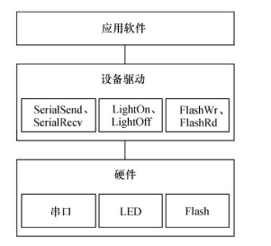
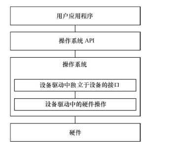

## 第1章 Linux设备驱动概述及开发环境构建

        驱动的存在是为了隔离应用和硬件，在软件设计时要遵循**高内聚，低耦合**的要求    

        在无操作系统下：

        在有操作系统下：

    

        驱动不再是作为应用层的直接接口，而是通过呈现为操作系统的api让外部调用。在操作系统中驱动的编写变得更复杂，但是却给应用层提供了统一的接口去操作字符设备、块设备（read，write，open，close）

    

        驱动被分为：字符设备：必须串行顺序访问的设备

                               块设备：任意顺序访问的设备

                               网络设备：网络设备

        除网络设备外，字符设备和块设备都被映射linux的文件系统的文件和目录，通过系统调用操作。块设备有两种访问方式：1.通过dd命令操作对应的设备  2.在块设备上建立文件系统再访问。

## 第3章 Linux内核及内核编程

    内核一般要做到drivers与arch的软件架构分离，驱动中不包含板级信息，让驱动跨平台。同时内核的通用部分（如kernel、fs、ipc、net等）则与具体的硬件（arch和drivers）剥离
