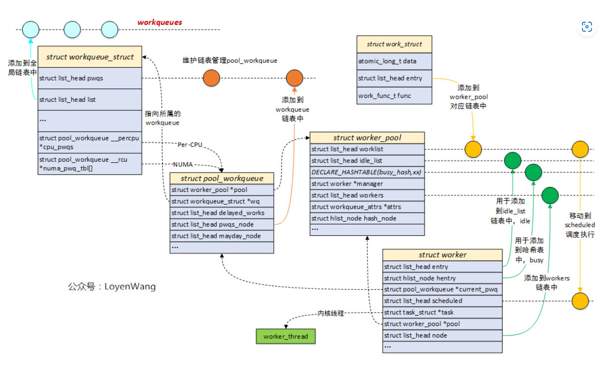

## 软中断

    软中断的分配是静态的，在编译时就已经确定了，软中断可以并发地运行在多个CPU上，因此，软中断是可重入函数并且必须明确地使用自旋锁保护其数据结构。

    软中断机制的核心部分是一个表，包含32个softirq_action类型的数据项。该数据类型结构非常简单，只包含两个成员：

```c
<interrupt.h> 
struct softirq_action 
{                     
    void (*action)(struct softirq_action *); 
    void *data;
}; 
static struct softirq_action softirq_vec[NR_SOFTIRQS] __cacheline_aligned_in_smp;
```

    其中action是一个指向处理程序例程的指针，在软中断发生时由内核执行该处理程序例程，而data是一个指向处理程序函数私有数据的指针。

    软中断必须先注册，然后内核才能执行软中断。open_softirq函数即用于该目的。它在softirq_ vec表中指定的位置写入新的软中断：

```c
void open_softirq(int nr, void (*action)(struct softirq_action*), void *data) 
{     
    softirq_vec[nr].data = data; 
    softirq_vec[nr].action = action; 
} 
```

    各个软中断都有一个唯一的编号，这表明软中断是相对稀缺的资源，使用其必须谨慎，不能由各种设备驱动程序和内核组件随意使用。和IRQ number一样，对于软中断，linux kernel也是用一个softirq number唯一标识一个softirq，具体定义如下：

```c
enum
{
    HI_SOFTIRQ=0,------------------------------用于高优先级的tasklet
    TIMER_SOFTIRQ,---------------------------用于基于系统tick的software timer
    NET_TX_SOFTIRQ,-------------------------用于发送网卡数据
    NET_RX_SOFTIRQ,-------------------------用于接收网卡数据
    BLOCK_SOFTIRQ,---------------------------用于块设备
    BLOCK_IOPOLL_SOFTIRQ,---------------用于块设备请求处理
    TASKLET_SOFTIRQ,------------------------tasklet
    SCHED_SOFTIRQ,---------------------------用于多CPU之间负载均衡
    HRTIMER_SOFTIRQ,------------------------用于高精度timer
    RCU_SOFTIRQ,    /* Preferable RCU should always be the last softirq */-------用于RCU

    NR_SOFTIRQS
};
```

    多个软中断可以同时在多个cpu运行，就算是同一种软中断，也有可能同时在多个cpu上运行。内核为每个cpu都管理着一个待决软中断变量（pending），它就是irq_cpustat_t：

```c
typedef struct {
    unsigned int __softirq_pending;
} ____cacheline_aligned irq_cpustat_t;
irq_cpustat_t irq_stat[NR_CPUS] ____cacheline_aligned;
```

    __softirq_pending字段中的每一个bit，对应着某一个软中断，某个bit被置位，说明有相应的软中断等待处理。

    触发软中断使用raise_softirq：

```c
void raise_softirq(unsigned int nr)
{
    unsigned long flags;

    local_irq_save(flags);
    raise_softirq_irqoff(nr);
    local_irq_restore(flags);
}

inline void raise_softirq_irqoff(unsigned int nr)
{
    __raise_softirq_irqoff(nr); －－－－－－－－－－－－－－－－（1）

    if (!in_interrupt())
        wakeup_softirqd();－－－－－－－－－－－－－－－－－－（2）
}
```

    __raise_softirq_irqoff函数设定本CPU上的__softirq_pending的某个bit等于1，具体的bit是由soft irq number（nr参数）指定的。该函数将相应的软中断标记为执行。如果不在中断上下文调用raise_softirq，则调用wakeup_softirqd来唤醒软中断守护进程。

### 软中断的执行

    软中断的执行既可以守护进程中执行，也可以在中断的退出阶段执行。软中断更多的是在中断的退出阶段执行（irq_exit），以便达到更快的响应，加入守护进程机制，只是担心一旦有大量的软中断等待执行，会使得内核过长地留在中断上下文中。

    a)在在irq_exit中执行

```c
void irq_exit(void)
{
        ......
    sub_preempt_count(IRQ_EXIT_OFFSET);
    if (!in_interrupt() && local_softirq_pending())
        invoke_softirq();
        ......
}
```

    invoke_softirq()最终会走到__do_softirq中

```c
asmlinkage void __do_softirq(void)
{

……

    pending = local_softirq_pending();－－－－－－－－－－－－－－－获取softirq pending的状态

    __local_bh_disable_ip(_RET_IP_, SOFTIRQ_OFFSET);－－－标识下面的代码是正在处理softirq

    cpu = smp_processor_id();
restart:
    set_softirq_pending(0); －－－－－－－－－清除pending标志

    local_irq_enable(); －－－－－－打开中断，softirq handler是开中断执行的

    h = softirq_vec; －－－－－－－获取软中断描述符指针

    while ((softirq_bit = ffs(pending))) {－－－－－－－寻找pending中第一个被设定为1的bit
        unsigned int vec_nr;
        int prev_count;

        h += softirq_bit - 1; －－－－－－指向pending的那个软中断描述符

        vec_nr = h - softirq_vec;－－－－获取soft irq number
        h->action(h);－－－－－－－－－指向softirq handler
        h++;
        pending >>= softirq_bit;
    }

    local_irq_disable(); －－－－－－－关闭本地中断

    pending = local_softirq_pending();－－－－－－－－－－（注1）
    if (pending) {
        if (time_before(jiffies, end) && !need_resched() &&
            --max_restart)
            goto restart;

        wakeup_softirqd();
    }

    __local_bh_enable(SOFTIRQ_OFFSET);－－－－－－－－－－标识softirq处理完毕
}
```

    该函数在每次restart时都会清除pending标志（在这之前已经从全局pending拿到了），随后开中断（可以被硬件中断打断），接着遍历并处理挂起的软中断（调用softirq_vec[nr].action），在全部处理完之后关闭中断，再次从全局拿pending，如果拿到了话继续走restart，如果在max_restart次重启处理过程之后仍然有未处理的软中断，核将调用wakeup_softirqd唤醒软中断守护进程。

    b)软中断守护进程中执行

    软中断守护进程的任务是，与其余内核代码异步执行软中断。内核为每个cpu创建了一个用于执行软中断的守护进程ksoftirqd，同时定义了一个per_cpu变量用于保存每个守护进程的task_struct结构指针：

```c
DEFINE_PER_CPU(struct task_struct *, ksoftirqd);
```

    守护进程执行以下死循环：

```c
kernel/softirq.c 
static int ksoftirqd(void * __bind_cpu) 
...     
    while (!kthread_should_stop()) { 
        if (!local_softirq_pending()) { 
            schedule(); 
        } 
        __set_current_state(TASK_RUNNING); 
        while (local_softirq_pending()) { 
            do_softirq(); 
            cond_resched(); 
            } 
        set_current_state(TASK_INTERRUPTIBLE); 
    } 
    ... 
}
```

    如果当前没有待处理的软中断，将会调用调度器将控制转交其他进程。如果有要处理的软中断，将会在一个while里处理所有软中断。

### tasklet

    tasklet和工作队列是延期执行工作的机制，其实现基于软中断但它们更易于使用，因而更适合于设备驱动程序（以及其他一般性的内核代码）。

    tasklet是在软中断之上实现的（HI_SOFTIRQ和TASKLET_SOFTIRQ）。但和软中断不同的是，同一种tasklet不可以在多个CPU上并发运行，但是不同类型的tasklet可以在多个CPU上并发运行，所以tasklet函数可以不是可重入的，简化了驱动开发者的工作。

#### 创建tasklet

   每个cpu都会维护一个链表，将本cpu需要处理的tasklet管理起来，各个tasklet的中枢数据结构称作tasklet_struct，定义如下：

```c
<interrupt.h> 
struct tasklet_struct 
{     
    struct tasklet_struct *next; 
    unsigned long state; 
    atomic_t count; 
    void (*func)(unsigned long); 
    unsigned long data; 
}; 

static DEFINE_PER_CPU(struct tasklet_head, tasklet_vec);
static DEFINE_PER_CPU(struct tasklet_head, tasklet_hi_vec);
```

+ 从设备驱动程序的角度来看，最重要的成员是func。它指向一个函数的地址，该函数的执行将被延期。

+ data用作该函数执行时的参数。

+ next是一个指针，用于建立tasklet_struct实例的链表。这容许几个任务排队执行。

+ state表示任务的当前状态，类似于真正的进程。在tasklet注册到内核，等待调度执行时，将设置TASKLET_STATE_SCHED   TASKLET_STATE_RUN表示tasklet当前正在执行

+ 原子计数器count用于禁用已经调度的tasklet。如果其值不等于0，在接下来执行所有待决的tasklet时，将忽略对应的tasklet

```c
#define DECLARE_TASKLET(name, func, data) \
struct tasklet_struct name = { NULL, 0, ATOMIC_INIT(0), func, data }
```

#### 注册tasklet

    tasklet_schedule将一个tasklet注册到系统中：

```c
static inline void tasklet_schedule(struct tasklet_struct *t)
{
    if (!test_and_set_bit(TASKLET_STATE_SCHED, &t->state))
        __tasklet_schedule(t);
}
```

    TASKLET_STATE_SCHED这个flag保证该tasklet只被调度一次，原理如下：假设在中断中使用tasklet机制（这个tasklet是对所有cpu可见的，不是per-cpu的），第一次中断被分发给CPU0执行，该driver的tasklet被挂入CPU0对应的tasklet链表（tasklet_vec）并将state的状态设定为TASKLET_STATE_SCHED。假如下次又触发中断并在cpu1上执行，虽然会再次调用tasklet_schedule，但是由于TASKLET_STATE_SCHED已被设定，不会将该driver的tasklet再次挂入CPU1对应的tasklet链表。

    在__tasklet_schedule中，将结构体挂入当前cpu的tasklet的尾部

```c
void __tasklet_schedule(struct tasklet_struct *t)
{
    unsigned long flags;

    local_irq_save(flags);
    t->next = NULL;
    *__this_cpu_read(tasklet_vec.tail) = t;
    __this_cpu_write(tasklet_vec.tail, &(t->next));
    raise_softirq_irqoff(TASKLET_SOFTIRQ);
    local_irq_restore(flags);
}
```

tasklet执行：

    当软中断执行时且类型为tasklet时，会调用tasklet_action

```c
static void tasklet_action(struct softirq_action *a)
{
	struct tasklet_struct *list;

	local_irq_disable();
	list = __get_cpu_var(tasklet_vec).list;
	__get_cpu_var(tasklet_vec).list = NULL;
	local_irq_enable();

	while (list) {
		struct tasklet_struct *t = list;

		list = list->next;

		if (tasklet_trylock(t)) {
			if (!atomic_read(&t->count)) {
				if (!test_and_clear_bit(TASKLET_STATE_SCHED, &t->state))
					BUG();
				t->func(t->data);
				tasklet_unlock(t);
				continue;
			}
			tasklet_unlock(t);
		}

		local_irq_disable();
		t->next = __get_cpu_var(tasklet_vec).list;
		__get_cpu_var(tasklet_vec).list = t;
		__raise_softirq_irqoff(TASKLET_SOFTIRQ);
		local_irq_enable();
	}
}
```

### 工作队列

    工作队列的出现更多的是为了解决软中断和Tasklet对于用户进程的时间片的不良影响问题的。

work_struct：工作队列调度的最小单位，~~~~work item；
workqueue_struct：工作队列，work item都挂入到工作队列中；
worker：work item的处理者，每个worker对应一个内核线程；
worker_pool：worker池（内核线程池），是一个共享资源池，提供不同的worker来对work item进行处理；
pool_workqueue：充当桥梁纽带的作用，用于连接workqueue和worker_pool，建立链接关系；

    

    struct work_struct用来描述work，初始化一个work并添加到工作队列后，将会将其传递到合适的内核线程来进行处理，它是用于调度的最小单位:

```c
struct work_struct {
    	atomic_long_t data;     //低比特存放状态位，高比特存放worker_pool的ID或者pool_workqueue的指针
    	struct list_head entry; //用于添加到其他队列上
    	work_func_t func;       //工作任务的处理函数，在内核线程中回调
    #ifdef CONFIG_LOCKDEP
    	struct lockdep_map lockdep_map;
    #endif
};

```
