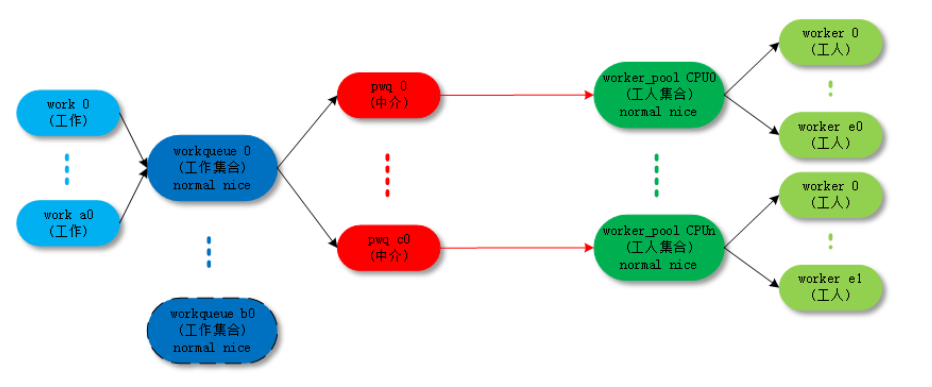
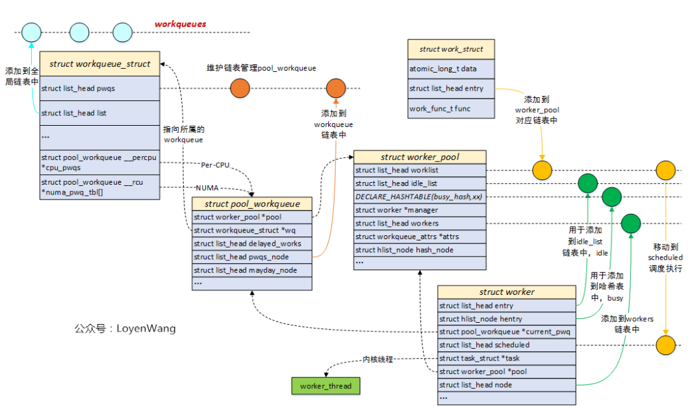
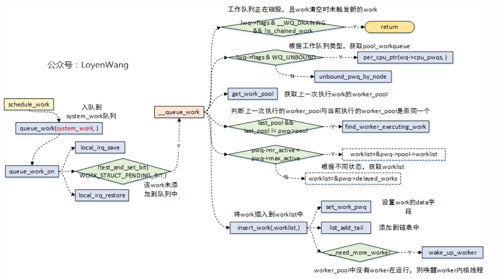

## 软中断

    软中断的分配是静态的，在编译时就已经确定了，软中断可以并发地运行在多个CPU上，因此，软中断是可重入函数并且必须明确地使用自旋锁保护其数据结构。

    软中断机制的核心部分是一个表，包含32个softirq_action类型的数据项。该数据类型结构非常简单，只包含两个成员：

```c
<interrupt.h> 
struct softirq_action 
{                     
    void (*action)(struct softirq_action *); 
    void *data;
}; 
static struct softirq_action softirq_vec[NR_SOFTIRQS] __cacheline_aligned_in_smp;
```

    其中action是一个指向处理程序例程的指针，在软中断发生时由内核执行该处理程序例程，而data是一个指向处理程序函数私有数据的指针。

    软中断必须先注册，然后内核才能执行软中断。open_softirq函数即用于该目的。它在softirq_ vec表中指定的位置写入新的软中断：

```c
void open_softirq(int nr, void (*action)(struct softirq_action*), void *data) 
{     
    softirq_vec[nr].data = data; 
    softirq_vec[nr].action = action; 
} 
```

    各个软中断都有一个唯一的编号，这表明软中断是相对稀缺的资源，使用其必须谨慎，不能由各种设备驱动程序和内核组件随意使用。和IRQ number一样，对于软中断，linux kernel也是用一个softirq number唯一标识一个softirq，具体定义如下：

```c
enum
{
    HI_SOFTIRQ=0,------------------------------用于高优先级的tasklet
    TIMER_SOFTIRQ,---------------------------用于基于系统tick的software timer
    NET_TX_SOFTIRQ,-------------------------用于发送网卡数据
    NET_RX_SOFTIRQ,-------------------------用于接收网卡数据
    BLOCK_SOFTIRQ,---------------------------用于块设备
    BLOCK_IOPOLL_SOFTIRQ,---------------用于块设备请求处理
    TASKLET_SOFTIRQ,------------------------tasklet
    SCHED_SOFTIRQ,---------------------------用于多CPU之间负载均衡
    HRTIMER_SOFTIRQ,------------------------用于高精度timer
    RCU_SOFTIRQ,    /* Preferable RCU should always be the last softirq */-------用于RCU

    NR_SOFTIRQS
};
```

    多个软中断可以同时在多个cpu运行，就算是同一种软中断，也有可能同时在多个cpu上运行。内核为每个cpu都管理着一个待决软中断变量（pending），它就是irq_cpustat_t：

```c
typedef struct {
    unsigned int __softirq_pending;
} ____cacheline_aligned irq_cpustat_t;
irq_cpustat_t irq_stat[NR_CPUS] ____cacheline_aligned;
```

    __softirq_pending字段中的每一个bit，对应着某一个软中断，某个bit被置位，说明有相应的软中断等待处理。

    触发软中断使用raise_softirq：

```c
void raise_softirq(unsigned int nr)
{
    unsigned long flags;

    local_irq_save(flags);
    raise_softirq_irqoff(nr);
    local_irq_restore(flags);
}

inline void raise_softirq_irqoff(unsigned int nr)
{
    __raise_softirq_irqoff(nr); －－－－－－－－－－－－－－－－（1）

    if (!in_interrupt())
        wakeup_softirqd();－－－－－－－－－－－－－－－－－－（2）
}
```

    __raise_softirq_irqoff函数设定本CPU上的__softirq_pending的某个bit等于1，具体的bit是由soft irq number（nr参数）指定的。该函数将相应的软中断标记为执行。如果不在中断上下文调用raise_softirq，则调用wakeup_softirqd来唤醒软中断守护进程。

### 软中断的执行

    软中断的执行既可以守护进程中执行，也可以在中断的退出阶段执行。软中断更多的是在中断的退出阶段执行（irq_exit），以便达到更快的响应，加入守护进程机制，只是担心一旦有大量的软中断等待执行，会使得内核过长地留在中断上下文中。

    a)在在irq_exit中执行

```c
void irq_exit(void)
{
        ......
    sub_preempt_count(IRQ_EXIT_OFFSET);
    if (!in_interrupt() && local_softirq_pending())
        invoke_softirq();
        ......
}
```

    invoke_softirq()最终会走到__do_softirq中

```c
asmlinkage void __do_softirq(void)
{

……

    pending = local_softirq_pending();－－－－－－－－－－－－－－－获取softirq pending的状态

    __local_bh_disable_ip(_RET_IP_, SOFTIRQ_OFFSET);－－－标识下面的代码是正在处理softirq

    cpu = smp_processor_id();
restart:
    set_softirq_pending(0); －－－－－－－－－清除pending标志

    local_irq_enable(); －－－－－－打开中断，softirq handler是开中断执行的

    h = softirq_vec; －－－－－－－获取软中断描述符指针

    while ((softirq_bit = ffs(pending))) {－－－－－－－寻找pending中第一个被设定为1的bit
        unsigned int vec_nr;
        int prev_count;

        h += softirq_bit - 1; －－－－－－指向pending的那个软中断描述符

        vec_nr = h - softirq_vec;－－－－获取soft irq number
        h->action(h);－－－－－－－－－指向softirq handler
        h++;
        pending >>= softirq_bit;
    }

    local_irq_disable(); －－－－－－－关闭本地中断

    pending = local_softirq_pending();－－－－－－－－－－（注1）
    if (pending) {
        if (time_before(jiffies, end) && !need_resched() &&
            --max_restart)
            goto restart;

        wakeup_softirqd();
    }

    __local_bh_enable(SOFTIRQ_OFFSET);－－－－－－－－－－标识softirq处理完毕
}
```

    该函数在每次restart时都会清除pending标志（在这之前已经从全局pending拿到了），随后开中断（可以被硬件中断打断），接着遍历并处理挂起的软中断（调用softirq_vec[nr].action），在全部处理完之后关闭中断，再次从全局拿pending，如果拿到了话继续走restart，如果在max_restart次重启处理过程之后仍然有未处理的软中断，核将调用wakeup_softirqd唤醒软中断守护进程。

    b)软中断守护进程中执行

    软中断守护进程的任务是，与其余内核代码异步执行软中断。内核为每个cpu创建了一个用于执行软中断的守护进程ksoftirqd，同时定义了一个per_cpu变量用于保存每个守护进程的task_struct结构指针：

```c
DEFINE_PER_CPU(struct task_struct *, ksoftirqd);
```

    守护进程执行以下死循环：

```c
kernel/softirq.c 
static int ksoftirqd(void * __bind_cpu) 
...     
    while (!kthread_should_stop()) { 
        if (!local_softirq_pending()) { 
            schedule(); 
        } 
        __set_current_state(TASK_RUNNING); 
        while (local_softirq_pending()) { 
            do_softirq(); 
            cond_resched(); 
            } 
        set_current_state(TASK_INTERRUPTIBLE); 
    } 
    ... 
}
```

    如果当前没有待处理的软中断，将会调用调度器将控制转交其他进程。如果有要处理的软中断，将会在一个while里处理所有软中断。

### tasklet

    tasklet和工作队列是延期执行工作的机制，其实现基于软中断但它们更易于使用，因而更适合于设备驱动程序（以及其他一般性的内核代码）。

    tasklet是在软中断之上实现的（HI_SOFTIRQ和TASKLET_SOFTIRQ）。但和软中断不同的是，同一种tasklet不可以在多个CPU上并发运行，但是不同类型的tasklet可以在多个CPU上并发运行，所以tasklet函数可以不是可重入的，简化了驱动开发者的工作。

#### 创建tasklet

   每个cpu都会维护一个链表，将本cpu需要处理的tasklet管理起来，各个tasklet的中枢数据结构称作tasklet_struct，定义如下：

```c
<interrupt.h> 
struct tasklet_struct 
{     
    struct tasklet_struct *next; 
    unsigned long state; 
    atomic_t count; 
    void (*func)(unsigned long); 
    unsigned long data; 
}; 

static DEFINE_PER_CPU(struct tasklet_head, tasklet_vec);
static DEFINE_PER_CPU(struct tasklet_head, tasklet_hi_vec);
```

+ 从设备驱动程序的角度来看，最重要的成员是func。它指向一个函数的地址，该函数的执行将被延期。

+ data用作该函数执行时的参数。

+ next是一个指针，用于建立tasklet_struct实例的链表。这容许几个任务排队执行。

+ state表示任务的当前状态，类似于真正的进程。在tasklet注册到内核，等待调度执行时，将设置TASKLET_STATE_SCHED   TASKLET_STATE_RUN表示tasklet当前正在执行

+ 原子计数器count用于禁用已经调度的tasklet。如果其值不等于0，在接下来执行所有待决的tasklet时，将忽略对应的tasklet

```c
#define DECLARE_TASKLET(name, func, data) \
struct tasklet_struct name = { NULL, 0, ATOMIC_INIT(0), func, data }
```

#### 注册tasklet

    tasklet_schedule将一个tasklet注册到系统中：

```c
static inline void tasklet_schedule(struct tasklet_struct *t)
{
    if (!test_and_set_bit(TASKLET_STATE_SCHED, &t->state))
        __tasklet_schedule(t);
}
```

    TASKLET_STATE_SCHED这个flag保证该tasklet只被调度一次，原理如下：假设在中断中使用tasklet机制（这个tasklet是对所有cpu可见的，不是per-cpu的），第一次中断被分发给CPU0执行，该driver的tasklet被挂入CPU0对应的tasklet链表（tasklet_vec）并将state的状态设定为TASKLET_STATE_SCHED。假如下次又触发中断并在cpu1上执行，虽然会再次调用tasklet_schedule，但是由于TASKLET_STATE_SCHED已被设定，不会将该driver的tasklet再次挂入CPU1对应的tasklet链表。

    在__tasklet_schedule中，将结构体挂入当前cpu的tasklet的尾部

```c
void __tasklet_schedule(struct tasklet_struct *t)
{
    unsigned long flags;

    local_irq_save(flags);
    t->next = NULL;
    *__this_cpu_read(tasklet_vec.tail) = t;
    __this_cpu_write(tasklet_vec.tail, &(t->next));
    raise_softirq_irqoff(TASKLET_SOFTIRQ);
    local_irq_restore(flags);
}
```

tasklet执行：

    当软中断执行时且类型为tasklet时，会调用tasklet_action

```c
static void tasklet_action(struct softirq_action *a)
{
    struct tasklet_struct *list;

    local_irq_disable();
    list = __get_cpu_var(tasklet_vec).list;
    __get_cpu_var(tasklet_vec).list = NULL;
    local_irq_enable();

    while (list) {
        struct tasklet_struct *t = list;

        list = list->next;

        if (tasklet_trylock(t)) {
            if (!atomic_read(&t->count)) {
                if (!test_and_clear_bit(TASKLET_STATE_SCHED, &t->state))
                    BUG();
                t->func(t->data);
                tasklet_unlock(t);
                continue;
            }
            tasklet_unlock(t);
        }

        local_irq_disable();
        t->next = __get_cpu_var(tasklet_vec).list;
        __get_cpu_var(tasklet_vec).list = t;
        __raise_softirq_irqoff(TASKLET_SOFTIRQ);
        local_irq_enable();
    }
}
```

### 工作队列

    工作队列的出现更多的是为了解决软中断和Tasklet对于用户进程的时间片的不良影响问题的。

    先介绍workqueue的基础概念：

+ work ：工作。

+ workqueue ：工作的集合。workqueue 和 work 是一对多的关系。

+ worker ：工人。在代码中 worker 对应一个 内核线程。work_thread()

+ worker_pool：工人的集合。worker_pool 和 worker 是一对多的关系。

+ pwq（pool_workqueue）：中间人 / 中介，负责建立起 WorkQueue 和 worker_pool 之间的关系。workqueue 和 pwq 是一对多的关系，pwq 和 worker_pool 是一对一的关系。




    work使用struct work_struct来描述，初始化一个work并添加到工作队列后，将会将其传递到合适的内核线程来进行处理，它是用于调度的最小单位。

```c
struct work_struct {
	atomic_long_t data;     //低比特存放状态位，高比特存放worker_pool的ID或者pool_workqueue的指针
	struct list_head entry; //用于添加到其他队列上
	work_func_t func;       //工作任务的处理函数，在内核线程中回调
#ifdef CONFIG_LOCKDEP
	struct lockdep_map lockdep_map;
#endif
};
```

    在内核中工作队列分为两种：

1. bound：绑定处理器的工作队列，每个worker创建的内核线程绑定到特定的CPU上运行；
2. unbound：不绑定处理器的工作队列，创建的时候需要指定WQ_UNBOUND标志，内核线程可以在处理器间迁移；

```c
struct workqueue_struct {
	struct list_head	pwqs;		/* WR: all pwqs of this wq */   //所有的pool_workqueue都添加到本链表中
	struct list_head	list;		/* PR: list of all workqueues */    //用于将工作队列添加到全局链表workqueues中

	struct list_head	maydays;	/* MD: pwqs requesting rescue */    //rescue状态下的pool_workqueue添加到本链表中
	struct worker		*rescuer;	/* I: rescue worker */  //rescuer内核线程，用于处理内存紧张时创建工作线程失败的情况

	struct pool_workqueue	*dfl_pwq;	/* PW: only for unbound wqs */

	char			name[WQ_NAME_LEN]; /* I: workqueue name */

	/* hot fields used during command issue, aligned to cacheline */
	unsigned int		flags ____cacheline_aligned; /* WQ: WQ_* flags */
	struct pool_workqueue __percpu *cpu_pwqs; /* I: per-cpu pwqs */     //Per-CPU都创建pool_workqueue
	struct pool_workqueue __rcu *numa_pwq_tbl[]; /* PWR: unbound pwqs indexed by node */    //Per-Node创建pool_workqueue
    ...
};
```

    pool_workqueue,用于将workqueue和worker_pool关联起来

```c
struct pool_workqueue {
	struct worker_pool	*pool;		/* I: the associated pool */    //指向worker_pool
	struct workqueue_struct *wq;		/* I: the owning workqueue */   //指向所属的workqueue

	int			nr_active;	/* L: nr of active works */     //活跃的work数量
	int			max_active;	/* L: max active works */   //活跃的最大work数量
	struct list_head	delayed_works;	/* L: delayed works */      //延迟执行的work挂入本链表
	struct list_head	pwqs_node;	/* WR: node on wq->pwqs */      //用于添加到workqueue链表中
	struct list_head	mayday_node;	/* MD: node on wq->maydays */   //用于添加到workqueue链表中
    ...
} __aligned(1 << WORK_STRUCT_FLAG_BITS);
```

    worker_pool是一个资源池，管理多个worker，也就是管理多个内核线程；针对绑定类型的工作队列，`worker_pool`是Per-CPU创建，每个CPU都有两个`worker_pool`，对应不同的优先级，nice值分别为0和-20

```c
struct worker_pool {
	spinlock_t		lock;		/* the pool lock */
	int			cpu;		/* I: the associated cpu */     //绑定到CPU的workqueue，代表CPU ID
	int			node;		/* I: the associated node ID */ //非绑定类型的workqueue，代表内存Node ID
	int			id;		/* I: pool ID */
	unsigned int		flags;		/* X: flags */

	unsigned long		watchdog_ts;	/* L: watchdog timestamp */

	struct list_head	worklist;	/* L: list of pending works */  //pending状态的work添加到本链表
	int			nr_workers;	/* L: total number of workers */    //worker的数量

	/* nr_idle includes the ones off idle_list for rebinding */
	int			nr_idle;	/* L: currently idle ones */

	struct list_head	idle_list;	/* X: list of idle workers */   //处于IDLE状态的worker添加到本链表
	struct timer_list	idle_timer;	/* L: worker idle timeout */
	struct timer_list	mayday_timer;	/* L: SOS timer for workers */

	/* a workers is either on busy_hash or idle_list, or the manager */
	DECLARE_HASHTABLE(busy_hash, BUSY_WORKER_HASH_ORDER);   //工作状态的worker添加到本哈希表中
						/* L: hash of busy workers */

	/* see manage_workers() for details on the two manager mutexes */
	struct worker		*manager;	/* L: purely informational */
	struct mutex		attach_mutex;	/* attach/detach exclusion */
	struct list_head	workers;	/* A: attached workers */   //worker_pool管理的worker添加到本链表中
	struct completion	*detach_completion; /* all workers detached */

	struct ida		worker_ida;	/* worker IDs for task name */

	struct workqueue_attrs	*attrs;		/* I: worker attributes */
	struct hlist_node	hash_node;	/* PL: unbound_pool_hash node */    //用于添加到unbound_pool_hash中
    ...
} ____cacheline_aligned_in_smp;
```



#### 调度方式

    在app中schedule_work，根据工作队列的类型获取pool_workqueue（bound和unbound），bound类型根据cpu获取pool_workqueue（per_cpu_ptr(wq->cpu_pwqs)）,将work插入到worker_pool对应的worklist中。

 

    work添加到工作队列之后，最终在worker_thread中执行。

```c
static int worker_thread(void *__worker)
{
	struct worker *worker = __worker;
	struct worker_pool *pool = worker->pool;

	/* tell the scheduler that this is a workqueue worker */
	set_pf_worker(true);
woke_up:
	raw_spin_lock_irq(&pool->lock);

	/* am I supposed to die? */
	if (unlikely(worker->flags & WORKER_DIE)) {
		raw_spin_unlock_irq(&pool->lock);
		set_pf_worker(false);
		/*
		 * The worker is dead and PF_WQ_WORKER is cleared, worker->pool
		 * shouldn't be accessed, reset it to NULL in case otherwise.
		 */
		worker->pool = NULL;
		ida_free(&pool->worker_ida, worker->id);
		return 0;
	}

	worker_leave_idle(worker);
recheck:
	/* no more worker necessary? */
	if (!need_more_worker(pool))
		goto sleep;

	/* do we need to manage? */
	if (unlikely(!may_start_working(pool)) && manage_workers(worker))
		goto recheck;

	/*
	 * ->scheduled list can only be filled while a worker is
	 * preparing to process a work or actually processing it.
	 * Make sure nobody diddled with it while I was sleeping.
	 */
	WARN_ON_ONCE(!list_empty(&worker->scheduled));

	/*
	 * Finish PREP stage.  We're guaranteed to have at least one idle
	 * worker or that someone else has already assumed the manager
	 * role.  This is where @worker starts participating in concurrency
	 * management if applicable and concurrency management is restored
	 * after being rebound.  See rebind_workers() for details.
	 */
	worker_clr_flags(worker, WORKER_PREP | WORKER_REBOUND);

	do {
		struct work_struct *work =
			list_first_entry(&pool->worklist,
					 struct work_struct, entry);

		if (assign_work(work, worker, NULL))
			process_scheduled_works(worker);
	} while (keep_working(pool));

	worker_set_flags(worker, WORKER_PREP);
sleep:
	/*
	 * pool->lock is held and there's no work to process and no need to
	 * manage, sleep.  Workers are woken up only while holding
	 * pool->lock or from local cpu, so setting the current state
	 * before releasing pool->lock is enough to prevent losing any
	 * event.
	 */
	worker_enter_idle(worker);
	__set_current_state(TASK_IDLE);
	raw_spin_unlock_irq(&pool->lock);
	schedule();
	goto woke_up;
}
```
