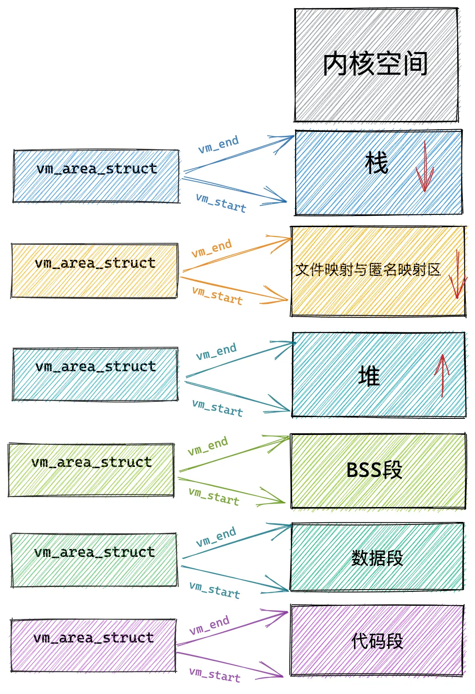

## UMA/NUMA架构

 1.UMA计算机（一致性内存），将可用内存以连续方式组织起来


2.NUMA计算机（非一致性内存），每个cpu都有自己的内存，可以快速访问，cpu也可以访问不属于自己的内存，但是访问速度会慢一些。


### (N)UMA 模型中的内存组织

    在UMA系统上，只使用一个NUMA结点来管理整个系统内存。而内存管理的其他部分则相信它们是在处理一个伪NUMA系统。

    内存划分为节点，每个节点关联到系统的一个处理器，在内核中表示为pg_data_t的实 例，每个节点又划分为内存域，将内存进一步划分（在UMA系统上，对应的只有一个pg_data_t）,各个内存域都关联了一个数组，用来组织属于该内存域的物理内存页（内核中称之为页帧）。对每个页帧，都分配了一个struct page实例以及所需的管理数据。


## 页表

## 页表结构

    以四级页表为例，页表结构分别为PGD，PUD，PMD，PTE，在页表组织上如下图：


    每一级页表由若干个条目组成：

```c
// 页表条目
typedef struct { unsigned long pte; } pte_t;
// PMD条目
typedef struct { unsigned long pmd; } pmd_t;
// PUD条目
typedef struct { unsigned long pud; } pud_t;
// PGD条目
typedef struct { unsigned long pgd; } pgd_t;
```

    每个条目是一个unsigned long类型的数，一共64位，排布如下：

```c
//0-12位是标志位，用来标记页的一些性质
#define _PAGE_BIT_PRESENT    0    /* is present */
#define _PAGE_BIT_RW        1    /* writeable */
#define _PAGE_BIT_USER        2    /* userspace addressable */
#define _PAGE_BIT_PWT        3    /* page write through */
#define _PAGE_BIT_PCD        4    /* page cache disabled */
#define _PAGE_BIT_ACCESSED    5    /* was accessed (raised by CPU) */
#define _PAGE_BIT_DIRTY        6    /* was written to (raised by CPU) */
#define _PAGE_BIT_PSE        7    /* 4 MB (or 2MB) page */
#define _PAGE_BIT_PAT        7    /* on 4KB pages */
#define _PAGE_BIT_GLOBAL    8    /* Global TLB entry PPro+ */
#define _PAGE_BIT_SOFTW1    9    /* available for programmer */
#define _PAGE_BIT_SOFTW2    10    /* " */
#define _PAGE_BIT_SOFTW3    11    /* " */
#define _PAGE_BIT_PAT_LARGE    12    /* On 2MB or 1GB pages */

//12-57位，是pfn的有效页号，要注意的是：当12位为0时，位 12 作为 PFN 的一部分，
//当12位为1时，位 12 被标志位占用，但这种情况下通常是大页，位 12 被标志位占用，PFN 的位数会相应调整


//高地址保护键等标志占用 58-63 位（共 6 位）

#define _PAGE_BIT_SOFTW4    58    /* available for programmer */
#define _PAGE_BIT_PKEY_BIT0    59    /* Protection Keys, bit 1/4 */
#define _PAGE_BIT_PKEY_BIT1    60    /* Protection Keys, bit 2/4 */
#define _PAGE_BIT_PKEY_BIT2    61    /* Protection Keys, bit 3/4 */
#define _PAGE_BIT_PKEY_BIT3    62    /* Protection Keys, bit 4/4 */
#define _PAGE_BIT_NX        63    /* No execute: only valid after cpuid check */
```

    在四级页表中，虚拟地址的划分如下：

```c
63                  48 47                39 38                30 29                21 20                12 11                 0
+---------------------+---------------------+---------------------+---------------------+---------------------+----------------------+
|      符号扩展        |       PGD索引        |       PUD索引        |       PMD索引       |       PTE索引        |       页内偏移        |
|     (16 bits)       |      (9 bits)       |      (9 bits)       |      (9 bits)       |      (9 bits)       |      (12 bits)       |
+---------------------+---------------------+---------------------+---------------------+---------------------+----------------------+
```

    cr3中存储了PGD的基地址，通过cr3+虚拟地址的47-39位✖️页框大小，就可以得到下一级PUD的基地址

```c
static inline pud_t *pud_offset(p4d_t *pgd, unsigned long address)
{
    return (pud_t *)pgd_page_vaddr(*pgd) + pud_index(address);
}
```

    一直这样查下去会得到pte的基地址，通过pfn_pte（pte）得到具体的物理页帧号，这个流程走完就可以将虚拟地址从最顶层的cr3一直转换到物理页上，此时的物理页大小为4k，通过12位页内偏移可以寻到物理页上的每一个地方

## buddy

在分配物理内存时，为了解决外部碎片的问题，引入了buddy系统。buddy的管理对象是pg_data_t下的内存域zone,对于每个zone有一个free_area用于管理伙伴系统的内存free_area的下标对应的是内存页表的阶；free_area中nr_free记录当前内存域中空闲页块的个数，free_list用于连接空闲页的链表，又分为不可以移动页、可移动、可回收等。

```c
struct zone {
    ....
    /* free areas of different sizes */
    struct free_area    free_area[MAX_ORDER];
    ....
}
struct free_area {
    struct list_head    free_list[MIGRATE_TYPES];
    unsigned long        nr_free;
};

enum migratetype {
    MIGRATE_UNMOVABLE,
    MIGRATE_MOVABLE,
    MIGRATE_RECLAIMABLE,
    MIGRATE_PCPTYPES,    /* the number of types on the pcp lists */
    MIGRATE_HIGHATOMIC = MIGRATE_PCPTYPES,
#ifdef CONFIG_CMA
    MIGRATE_CMA,
#endif
#ifdef CONFIG_MEMORY_ISOLATION
    MIGRATE_ISOLATE,    /* can't allocate from here */
#endif
    MIGRATE_TYPES
};
```


    分配与释放的最小单位都是page，buddy操作的都是匿名页和缓存页，所以用到了union中第一个结构体：

```c
struct page {
    //page的标识位，PG_buddy表示该页属于伙伴系统空闲页
    //当被分配出去时PG_buddy就会被clear，表示该页已经不再属于伙伴系统
    //#define PG_buddy    0x00000080
    unsigned long flags;
    union {
        struct {    /* Page cache and anonymous pages */
            //连接空闲链表
            struct list_head lru;
            /* See page-flags.h for PAGE_MAPPING_FLAGS */
            struct address_space *mapping;
            //设置migratetype
            pgoff_t index;        /* Our offset within mapping. */
            //存储order值
            unsigned long private;
        };
        struct {    /* page_pool used by netstack */
            /**
             * @dma_addr: might require a 64-bit value even on
             * 32-bit architectures.
             */
            dma_addr_t dma_addr;
        };
        struct {    /* slab, slob and slub */
            union {
                struct list_head slab_list;
                struct {    /* Partial pages */
                    struct page *next;
#ifdef CONFIG_64BIT
                    int pages;    /* Nr of pages left */
                    int pobjects;    /* Approximate count */
#else
                    short int pages;
                    short int pobjects;
#endif
                };
            };
            struct kmem_cache *slab_cache; /* not slob */
            /* Double-word boundary */
            void *freelist;        /* first free object */
            union {
                void *s_mem;    /* slab: first object */
                unsigned long counters;        /* SLUB */
                struct {            /* SLUB */
                    unsigned inuse:16;
                    unsigned objects:15;
                    unsigned frozen:1;
                };
            };
        };

        ...

} _struct_page_alignment;
```

### 从buddy中申请内存

    从buddy中申请内存，核心函数是__alloc_pages_nodemask，在该函数中，核心申请会用到get_page_from_freelist，如果因为内存不足等问题，就会走到__alloc_pages_slowpath慢速路径中申请。

```c
struct page *
__alloc_pages_nodemask(gfp_t gfp_mask, unsigned int , int preferred_nid,
                            nodemask_t *nodemask)
{
    struct page *page;
    unsigned int alloc_flags = ALLOC_WMARK_LOW;
    unsigned long long alloc_entry_time;
    gfp_t alloc_mask; /* The gfp_t that was actually used for allocation */
    struct alloc_context ac = { };

    //检查是否超过最大值
    if (unlikely(order >= MAX_ORDER)) {
        WARN_ON_ONCE(!(gfp_mask & __GFP_NOWARN));
        return NULL;
    }

    ...

    //快速路径分配
    page = get_page_from_freelist(alloc_mask, order, alloc_flags, &ac);
    if (likely(page))
        goto out;

    //如果快速路径分配不成功，就要走慢速路径
    /*
     * Apply scoped allocation constraints. This is mainly about GFP_NOFS
     * resp. GFP_NOIO which has to be inherited for all allocation requests
     * from a particular context which has been marked by
     * memalloc_no{fs,io}_{save,restore}.
     */
    alloc_mask = current_gfp_context(gfp_mask);
    ac.spread_dirty_pages = false;

    /*
     * Restore the original nodemask if it was potentially replaced with
     * &cpuset_current_mems_allowed to optimize the fast-path attempt.
     */
    if (unlikely(ac.nodemask != nodemask))
        ac.nodemask = nodemask;

    page = __alloc_pages_slowpath(alloc_mask, order, &ac);

out:
    if (memcg_kmem_enabled() && (gfp_mask & __GFP_ACCOUNT) && page &&
        unlikely(__memcg_kmem_charge(page, gfp_mask, order) != 0)) {
        __free_pages(page, order);
        page = NULL;
    }

    trace_mm_page_alloc(page, order, alloc_mask, ac.migratetype);

    sli_memlat_stat_end(MEM_LAT_PAGE_ALLOC, alloc_entry_time);
    return page;
}
```

    get_page_from_freelist中会遍历当前node的zonlist，会以当前zone优先去分配page，如果有足够内存就走rmqueue分配，如果不足就会退出走上一级的慢速路径

```c
static struct page *
get_page_from_freelistget_page_from_freelist(gfp_t gfp_mask, unsigned int order, int alloc_flags,
                        const struct alloc_context *ac)
{
    struct zoneref *z;
    struct zone *zone;
    struct pglist_data *last_pgdat_dirty_limit = NULL;
    bool no_fallback;

retry:
    /*
     * Scan zonelist, looking for a zone with enough free.
     * See also __cpuset_node_allowed() comment in kernel/cpuset.c.
     */
    no_fallback = alloc_flags & ALLOC_NOFRAGMENT;
    z = ac->preferred_zoneref;
    //遍历当前node的zonelist，寻找一个满足条件的zone，但是以当前zone优先
    for_next_zone_zonelist_nodemask(zone, z, ac->zonelist, ac->high_zoneidx,
                                ac->nodemask) {
        struct page *page;
        unsigned long mark;

        ...

        mark = wmark_pages(zone, alloc_flags & ALLOC_WMARK_MASK);
        //检查当前内存zone是否有足够空闲内存满足分配请求
        if (!zone_watermark_fast(zone, order, mark,
                       ac_classzone_idx(ac), alloc_flags,
                       gfp_mask)) {

            //一些其他策略保证内存分配
            ...

        }

try_this_zone:
        //实际从buddy分配
        page = rmqueue(ac->preferred_zoneref->zone, zone, order,
                gfp_mask, alloc_flags, ac->migratetype);
        if (page) {
            //申请出来的页面初始化
            prep_new_page(page, order, gfp_mask, alloc_flags);

            /*
             * If this is a high-order atomic allocation then check
             * if the pageblock should be reserved for the future
             */
            if (unlikely(order && (alloc_flags & ALLOC_HARDER)))
                reserve_highatomic_pageblock(page, zone, order);

            return page;
        } 

        ...

    return NULL;
}
```

    在这里分配内存时，对于0阶的分配直接走的是rmqueue_pcplist，从Per-CPU页面缓存分配单页，访问CPU本地缓存不需要获取zone锁，减少锁竞争。

```c
static inline
struct page *rmqueue(struct zone *preferred_zone,
            struct zone *zone, unsigned int order,
            gfp_t gfp_flags, unsigned int alloc_flags,
            int migratetype)
{
    unsigned long flags;
    struct page *page;

    //对于0阶内存的分配直接走rmqueue_pcplist
    if (likely(order == 0)) {
        page = rmqueue_pcplist(preferred_zone, zone, gfp_flags,
                    migratetype, alloc_flags);
        goto out;
    }
    WARN_ON_ONCE((gfp_flags & __GFP_NOFAIL) && (order > 1));
    //加锁
    spin_lock_irqsave(&zone->lock, flags);

    do {
        page = NULL;
        //alloc_flags位被置ALLOC_HARDER，走原子内存分配
        if (alloc_flags & ALLOC_HARDER) {
            page = __rmqueue_smallest(zone, order, MIGRATE_HIGHATOMIC);
            if (page)
                trace_mm_page_alloc_zone_locked(page, order, migratetype);
        }
        //常规分配
        if (!page)
            page = __rmqueue(zone, order, migratetype, alloc_flags);
    } while (page && check_new_pages(page, order));
    spin_unlock(&zone->lock);

    ...

    VM_BUG_ON_PAGE(page && bad_range(zone, page), page);
    return page;

failed:
    local_irq_restore(flags);
    return NULL;
}     
```

    可以看到__rmqueue内部实现也是调用了__rmqueue_smallest，只不过在后面多了__rmqueue_cma_fallback页面分裂的处理

```c
static __always_inline struct page *
__rmqueue(struct zone *zone, unsigned int order, int migratetype,
                        unsigned int alloc_flags)
{
    struct page *page;

retry:
    //尝试从指定迁移类型的空闲列表直接分配
    page = __rmqueue_smallest(zone, order, migratetype);
    //分配失败，从别的迁移类型的空闲列表窃取内存块到请求的迁移类型列表中
    if (unlikely(!page)) {
        //对MIGRATE_MOVABLE优先分配cma区域
        if (migratetype == MIGRATE_MOVABLE)
            page = __rmqueue_cma_fallback(zone, order);
        //
        if (!page && __rmqueue_fallback(zone, order, migratetype,
                                alloc_flags))
            goto retry;
    }

    trace_mm_page_alloc_zone_locked(page, order, migratetype);
    return page;
}
```

    申请内存

```c
static __always_inline
struct page *__rmqueue_smallest(struct zone *zone, unsigned int order,
                        int migratetype)
{
    unsigned int current_order;
    struct free_area *area;
    struct page *page;

    //从当前阶开始向上寻找
    for (current_order = order; current_order < MAX_ORDER; ++current_order) {
        //获取当前order对应的free_area
        area = &(zone-[current_order]);
        //尝试从指定迁移类型的链表中获取page
        page = get_page_from_free_area(area, migratetype);
        if (!page)
            continue;// 当前order没有可用页面则继续搜索
        //从空闲链表中移除该页面块
        del_page_from_free_area(page, area);
        //如果分配的内存大于当前阶，则需要拆分
        expand(zone, page, order, current_order, area, migratetype);
        set_pcppage_migratetype(page, migratetype);
        return page;
    }

    return NULL;
}
```

    当分配的内存大于当前需要的内存大小，就会分裂大块为小块

```c
//low为实际需要的页大小，high为分配的大小，high>low,所以要分裂
static inline void expand(struct zone *zone, struct page *page,
    int low, int high, struct free_area *area,
    int migratetype)
{
    //计算当前分配的页大小
    unsigned long size = 1 << high;

    while (high > low) {
        area--; //移到下一级area
        high--; //order减1
        size >>= 1;//大小减半
        VM_BUG_ON_PAGE(bad_range(zone, &page[size]), &page[size]);

        if (set_page_guard(zone, &page[size], high, migratetype))
            continue;
        //分裂出去的多余块加入空闲列表
        add_to_free_area(&page[size], area, migratetype);
        //设置PG_buddy空闲标志，当分裂出去的正在使用的块被释放时；设置page的实际order大小
        //如果相邻的原始分裂空闲块仍为空闲状态，若满足条件，两者会合并回最初的完整块
        //如果空闲块已经被分配，则释放的块会单独加入空闲链表
        set_page_order(&page[size], high);
    }
}
```

__alloc_pages_nodemask(根据内存使用情况，走快速分配/慢速路径)

    ->get_page_from_freelist (满足水位线需求，走快速分配,遍历zonelist找满足条件的zone)

        ->rmqueue(根据alloc_flags & ALLOC_HARDER，看是否需要更短的时间分配) **确定zone**

            ->__rmqueue(常规分配，如果分配失败，从别的迁移类型的空闲列表窃取内存块到请求的迁移类型列表中)   **确定迁移类型**

                ->__rmqueue_smallest(从指定的zone、迁移类型上遍历各个order)

                    ->get_page_from_free_area(分配page，这里的分配出来的page可能会大于需要的大小，需要在后续expand中分割)

                    ->expand(没有一样大小的空闲块，需要分裂)将分裂后空闲块设置成buddy块，给最终的分配块确定orderset_page_order(&page[size], high);

            ->rmqueue_pcplist(对于申请0阶的内存直接从Per-CPU页面缓存分配单页)

    ->__alloc_pages_slowpath(内存资源紧张，需要更复杂的分配策略）

### 从buddy中释放内存

    释放内存从free_pages说起，在释放内存时传入的参数是要释放内存的首地址，通过virt_to_page将地址转换为struct page结构体，在free_the_page中，会将0阶的释放单独处理，对应之前的单独申请。

```c
static inline void free_the_page(struct page *page, unsigned int order)
{
    if (order == 0)        /* Via pcp? */
        free_unref_page(page);
    else
        __free_pages_ok(page, order);
}

void __free_pages(struct page *page, unsigned int order)
{
    if (put_page_testzero(page))
        free_the_page(page, order);
}

void free_pages(unsigned long addr, unsigned int order)
{
    if (addr != 0) {
        VM_BUG_ON(!virt_addr_valid((void *)addr));
        __free_pages(virt_to_page((void *)addr), order);
    }
}
```

    在__free_pages_ok和free_one_page中做了一些预处理准备工作，在__free_one_page中释放

```c
static void __free_pages_ok(struct page *page, unsigned int order)
{
    unsigned long flags;
    int migratetype;
    unsigned long pfn = page_to_pfn(page);

    if (!free_pages_prepare(page, order, true))
        return;
    //获取迁移类型
    migratetype = get_pfnblock_migratetype(page, pfn);
    local_irq_save(flags);
    __count_vm_events(PGFREE, 1 << order);
    //核心释放操作
    free_one_page(page_zone(page), page, pfn, order, migratetype);
    local_irq_restore(flags);
}

static void free_one_page(struct zone *zone,
                struct page *page, unsigned long pfn,
                unsigned int order,
                int migratetype)
{
    spin_lock(&zone->lock);
    if (unlikely(has_isolate_pageblock(zone) ||
        is_migrate_isolate(migratetype))) {
        migratetype = get_pfnblock_migratetype(page, pfn);
    }
    __free_one_page(page, pfn, zone, order, migratetype);
    spin_unlock(&zone->lock);
}
```

sd

```c
static inline void __free_one_page(struct page *page,
        unsigned long pfn,
        struct zone *zone, unsigned int order,
        int migratetype)
{
    unsigned long combined_pfn;
    unsigned long uninitialized_var(buddy_pfn);
    struct page *buddy;
    unsigned int max_order;
    struct capture_control *capc = task_capc(zone);

    max_order = min_t(unsigned int, MAX_ORDER, pageblock_order + 1);

    ...    

continue_merging:
    while (order < max_order - 1) {
        if (compaction_capture(capc, page, order, migratetype)) {
            __mod_zone_freepage_state(zone, -(1 << order),
                                migratetype);
            return;
        }
        //找到相同阶的伙伴（不一定空闲）
        buddy_pfn = __find_buddy_pfn(pfn, order);     
        //找到伙伴页的page结构体   
        buddy = page + (buddy_pfn - pfn);

        // 检查伙伴页pfn是否有效
        if (!pfn_valid_within(buddy_pfn))
            goto done_merging;
        // 检查伙伴页是否是真正的伙伴(同阶且空闲)
        if (!page_is_buddy(page, buddy, order))
            goto done_merging;

        //对于保护页：清除页面的保护标志
        if (page_is_guard(buddy))
            clear_page_guard(zone, buddy, order, migratetype);
        else //对于非保护页：将伙伴页面从对应order的空闲区域列表中移除
            del_page_from_free_area(buddy, &zone->free_area[order]);
        //找到合并块的基地址
        combined_pfn = buddy_pfn & pfn;
        //合并后的page指针
        page = page + (combined_pfn - pfn);
        //更新pfn
        pfn = combined_pfn;
        //阶+1
        order++;
    }

    ...

done_merging:
    //为合并后的页面设置order    
    set_page_order(page, order);

    ...

    //是否随机插入空闲链表（通常配置为对order=3到order=10的页面启用）
    if (is_shuffle_order(order))
        add_to_free_area_random(page, &zone->free_area[order],
                migratetype);
    else
        //插入链表头部
        add_to_free_area(page, &zone->free_area[order], migratetype);

}
```

free_pages

    ->__free_pages

        ->free_the_page

            ->free_unref_page

            ->__free_pages_ok

                ->free_one_page

                           

在释放时page所在zone是如何找到的？

    在内存初始化阶段，就把每个page对应nid和zonenum写入page的flag中，之后不会变动，通过nid和zonenum定位page具体在哪个zone

在释放时page所属迁移类型是如何找到的？

    同样在内存初始化阶段，写入bitmap的pageblock中，通过bitmap查询

## slub

    在分配内存时，4k大小可能仍然很大，在申请小内存（例如4字节、8字节）时，直接分配一页会造成浪费。现在把这段连续内存平均分成若干大小相等的object（对象）进行管理。slab将一页的内存分为小块再分配，分配的粒度更小。

    在下面介绍slub时，以cpu本地的缓存为主，存取都以在本cpu缓存上为例。

```c
struct kmem_cache {
    //CPU 本地缓存
    struct kmem_cache_cpu __percpu *cpu_slab;

    slab_flags_t flags;
    unsigned long min_partial;
    //对象大小（包含元数据）
    unsigned int size;    /* The size of an object including metadata */
    //对象大小（不包含元数据）
    unsigned int object_size;/* The size of an object without metadata */
    //freelisgt的偏移
    unsigned int offset;    /* Free pointer offset */
    struct kmem_cache_order_objects oo;
    //slab分配策略
    struct kmem_cache_order_objects max;
    struct kmem_cache_order_objects min;

    ...
    //节点级缓存
    struct kmem_cache_node *node[MAX_NUMNODES];
};
```

    针对当前cpu的slub缓存：

```c
struct kmem_cache_cpu {
    void **freelist;    //指向下一个object
    unsigned long tid;    //全局唯一的事务ID，用于检测操作次数，是否被并发执行过
    struct page *page;    //当前正在分配内存的slab页面
#ifdef CONFIG_SLUB_CPU_PARTIAL
    struct page *partial;    /* Partially allocated frozen slabs */
#endif
#ifdef CONFIG_SLUB_STATS
    unsigned stat[NR_SLUB_STAT_ITEMS];
#endif
};
```

### slub初始化

    在使用slub之前需要先对slub进行初始化，将内存分割好，初始化缓存参数，计算对象布局，初始化操作主要在kmem_cache_create->kmem_cache_create_usercopy

->create_cache中

```c
static struct kmem_cache *create_cache(const char *name,
        unsigned int object_size, unsigned int align,
        slab_flags_t flags, unsigned int useroffset,
        unsigned int usersize, void (*ctor)(void *),
        struct mem_cgroup *memcg, struct kmem_cache *root_cache)
{
    struct kmem_cache *s;
    ...
    //从 kmem_cache 缓存中分配新的 struct kmem_cache 对象并初始化
    s = kmem_cache_zalloc(kmem_cache, GFP_KERNEL);
    if (!s)
        goto out;
    s->name = name;
    s->size = s->object_size = object_size;
    s->align = align;
    s->ctor = ctor;
    s->useroffset = useroffset;
    s->usersize = usersize;

    err = init_memcg_params(s, root_cache);
    if (err)
        goto out_free_cache;
    //
    err = __kmem_cache_create(s, flags);
    ...
}

struct kmem_cache *
kmem_cache_create_usercopy(const char *name,
          unsigned int size, unsigned int align,
          slab_flags_t flags,
          unsigned int useroffset, unsigned int usersize,
          void (*ctor)(void *))
{
    ...
    s = create_cache(cache_name, size,
             calculate_alignment(flags, align, size),
             flags, useroffset, usersize, ctor, NULL, NULL);
    ...
}
```

    内存分割操作主要在calculate_sizes函数中

```c
static int calculate_sizes(struct kmem_cache *s, int forced_order)
{
    slab_flags_t flags = s->flags;
    unsigned int size = s->object_size;
    unsigned int order;

    ...
    //确定在每次使用时的偏移 和 size等价 
    s->offset = size;
    //确定对齐后的对象大小 
    size = ALIGN(size, s->align);
    s->size = size;
    //根据对象大小确定页
    if (forced_order >= 0)
        order = forced_order;
    else
        order = calculate_order(size);

    if ((int)order < 0)
        return 0;

    //最优 slab 配置，当内存充足时，创建新的slab使用这个
    s->oo = oo_make(order, size);
    //最小 slab 配置，当内存紧张时，创建新的slab使用这个
    s->min = oo_make(get_order(size), size);
    if (oo_objects(s->oo) > oo_objects(s->max))
        s->max = s->oo;

    return !!oo_objects(s->oo);
}
```

### slub分配内存

```c
void *kmem_cache_alloc(struct kmem_cache *s, gfp_t gfpflags)
{
    void *ret = slab_alloc(s, gfpflags, _RET_IP_);

    trace_kmem_cache_alloc(_RET_IP_, ret, s->object_size,
                s->size, gfpflags);

    return ret;
}
static __always_inline void *slab_alloc(struct kmem_cache *s,
        gfp_t gfpflags, unsigned long addr)
{
    return slab_alloc_node(s, gfpflags, NUMA_NO_NODE, addr);
}
```

    slub先检查当前cpu缓存的freelist是否有可用对象，如果有就走无锁申请，如果没有就要调用__slab_alloc进行慢速处理

```c
static __always_inline void *slab_alloc_node(struct kmem_cache *s,
        gfp_t gfpflags, int node, unsigned long addr)
{
    void *object;
    struct kmem_cache_cpu *c;
    struct page *page;
    unsigned long tid;

    s = slab_pre_alloc_hook(s, gfpflags);
    if (!s)
        return NULL;
redo:

    //这里的c是读取的当前cpu的slub缓存 kmem_cache_cpu c = raw_cpu_ptr(s->cpu_slab);
    object = c->freelist;
    page = c->page;
    //当缓存用完时走慢速路径
    if (unlikely(!object || !page || !node_match(page, node))) {
        object = __slab_alloc(s, gfpflags, node, addr, c);
        stat(s, ALLOC_SLOWPATH);
    } else { //快速路径
        //获取下一个object用于swap
        //下一个object地址：freepointer_addr = (unsigned long)object + s->offset;
        void *next_object = get_freepointer_safe(s, object);
        //Compare-And-Swap，检查object和tid是否被修改
        //没有被修改就更新下一个object，和tid
        if (unlikely(!this_cpu_cmpxchg_double(
                s->cpu_slab->freelist, s->cpu_slab->tid,
                object, tid,
                next_object, next_tid(tid)))) {

            //如果被执行过就不能继续分配了，重新开始
            note_cmpxchg_failure("slab_alloc", s, tid);
            goto redo;
        }
        //提前将 next_object 加载到 CPU 缓存，优化下一次分配的内存访问速度。
        prefetch_freepointer(s, next_object);
        //记录快速路径分配统计
        stat(s, ALLOC_FASTPATH);
    }

    maybe_wipe_obj_freeptr(s, object);

    //按需初始化内存为 0
    if (unlikely(slab_want_init_on_alloc(gfpflags, s)) && object)
        memset(object, 0, s->object_size);

    slab_post_alloc_hook(s, gfpflags, 1, &object);

    return object;
}
```

## slub释放内存

    知道了分配内存的步骤，理解释放内存就简单很多，主要在do_slab_free中

```c
static __always_inline void do_slab_free(struct kmem_cache *s,
                struct page *page, void *head, void *tail,
                int cnt, unsigned long addr)
{
    void *tail_obj = tail ? : head;
    struct kmem_cache_cpu *c;
    unsigned long tid;

    ...
    //要释放的页就是缓存的页
    if (likely(page == c->page)) {
        //读取当前的空闲列表
        void **freelist = READ_ONCE(c->freelist);
        //将释放的对象链接到空闲列表头部
        set_freepointer(s, tail_obj, freelist);
        // 原子地更新空闲列表和 TID
        if (unlikely(!this_cpu_cmpxchg_double(
                s->cpu_slab->freelist, s->cpu_slab->tid,
                freelist, tid,
                head, next_tid(tid)))) {

            note_cmpxchg_failure("slab_free", s, tid);
            goto redo;
        }
        stat(s, FREE_FASTPATH);
    } else
        __slab_free(s, page, head, tail_obj, cnt, addr);

}
```

    由set_freepointer将释放的内存插入头部可看出，空闲列表是后进先出的栈式结构

# 虚拟内存相关

    在学习虚拟内存区域vm_area_struct前，先了解一下上层结构体。每个进程都有一个task_struct去记录进程相关信息，进程的虚拟空间相关信息在task_struct中的mm_struct中保存，task_size来界定物理地址和虚拟地址的分界线：


    内核中用 mm_struct 结构体中的上述属性来定义上图中虚拟内存空间里的不同内存区域,start_code和end_code定义代码段起始和终止位置；start_data和end_data定义数据段起始和终止位置；后面紧挨着的是 BSS 段，用于存放未被初始化的全局变量和静态变量；start_brk和brk定义堆的起始地址和结束地址

```c
struct mm_struct{
    unsigned long hiwater_rss; /* High-watermark of RSS usage */
    unsigned long hiwater_vm;  /* High-water virtual memory usage */

    unsigned long total_vm;       /* Total pages mapped */
    unsigned long locked_vm;   /* Pages that have PG_mlocked set */
    atomic64_t    pinned_vm;   /* Refcount permanently increased */
    unsigned long data_vm;       /* VM_WRITE & ~VM_SHARED & ~VM_STACK */
    unsigned long exec_vm;       /* VM_EXEC & ~VM_WRITE & ~VM_STACK */
    unsigned long stack_vm;       /* VM_STACK */
    unsigned long def_flags;

    spinlock_t arg_lock; /* protect the below fields */
    unsigned long start_code, end_code, start_data, end_data;
    unsigned long start_brk, brk, start_stack;
    unsigned long arg_start, arg_end, env_start, env_end;
}
```

    上面介绍了这些不同的内存区域，这些内存区域是由vm_area_struct来描述的



## 虚拟内存区域

每个区域表示为vm_area_struct的一个实例：

    用红黑树和双向链表结合来表示虚拟内存区域，在操作虚拟内存区域，总是保证同时更新两种结构。红黑树保证在通过地址查询对应VMA速度快，双向链表主要在顺序访问和相邻节点操作上较快（这里的双向链表总是按虚拟地址从低到高排序好的）

```c
struct vm_area_struct {
    //VMA起始地址
    unsigned long vm_start;    
    //VMA结束地址    
    unsigned long vm_end;    
    // [vm_start，vm_end) 左闭右开

    //双向链表
    struct vm_area_struct *vm_next, *vm_prev;
    //红黑树
    struct rb_node vm_rb;

    //VMA的操作集
    const struct vm_operations_struct *vm_ops;

    //文件映射时关联的文件
    struct file * vm_file;    

    //vm_mm是一个反向指针，指向该区域所属的mm_struct实例
    struct mm_struct *vm_mm;    
    //vm_page_prot存储该区域的访问权限
    pgprot_t vm_page_prot;        
    //vm_flags是描述该区域的一组标志
    unsigned long vm_flags;        

    ...

} __randomize_layout;
```

    对VMA的操作：如果一个新区域紧接着现存区域前后直接添加，如果权限都一样，则合并为一个；如果在区域的开始或结束处进行删除，则必须据此截断现存的数据结构；如果删除两个区域之间的一个区域，那么一方面需要减小现存数据结构的长度，另一方面需要为形成的新区域创建一个新的数据结构。


### vm_area_struct的创建

    在向数据结构插入新的内存区域之前，内核必须确认虚拟地址空间中有足够的空闲空间，可用于给定长度的区域，由get_unmapped_area函数完成

```c
unsigned long
get_unmapped_area(struct file *file, unsigned long addr, unsigned long len,
        unsigned long pgoff, unsigned long flags)
{
    unsigned long (*get_area)(struct file *, unsigned long,
                  unsigned long, unsigned long, unsigned long);
    //检查空间 
    unsigned long error = arch_mmap_check(addr, len, flags);
    if (error)
        return error;

    /* Careful about overflows.. */
    if (len > TASK_SIZE)
        return -ENOMEM;
    //实际的分配处理委托给当前进程 mm_struct实例中存储的特定于体系结构的辅助函数
    //大多数系统上采用的标准函数arch_get_unmapped_area
    get_area = current->mm->get_unmapped_area;
    if (file) {
        if (file->f_op->get_unmapped_area)
            get_area = file->f_op->get_unmapped_area;
    } else if (flags & MAP_SHARED) {
        pgoff = 0;
        get_area = shmem_get_unmapped_area;
    }

    addr = get_area(file, addr, len, pgoff, flags);

    ...

    return error ? error : addr;
}
```

    arch_get_unmapped_area首先必须检查是否设置了MAP_FIXED标志，该标志表示映射将在固定地址创建，如果没有指定区域位置，内核将在进程的虚似内存区中查找适当的可用区域。如果指定了一个特定的优先选用(与固定地址不同)地址，内核会检查该区域是否与现存区域重叠。如果不重叠，则将该地址作为目标返回

```c
unsigned long
arch_get_unmapped_area(struct file *filp, unsigned long addr,
        unsigned long len, unsigned long pgoff, unsigned long flags)
{
    struct mm_struct *mm = current->mm;
    struct vm_area_struct *vma, *prev;
    struct vm_unmapped_area_info info;
    const unsigned long mmap_end = arch_get_mmap_end(addr);

    if (len > mmap_end - mmap_min_addr)
        return -ENOMEM;
    //固定区域创建
    if (flags & MAP_FIXED)
        return addr;
    //指定了特定的优先选用地址
    if (addr) {
        addr = PAGE_ALIGN(addr);
        //查找该地址附近的VMA区域
        vma = find_vma_prev(mm, addr, &prev);
        //检查找到的地址是否可用（没有和现有的VMA重叠）
        if (mmap_end - len >= addr && addr >= mmap_min_addr &&
            (!vma || addr + len <= vm_start_gap(vma)) &&
            (!prev || addr >= vm_end_gap(prev)))
            return addr;
    }

    //没有指定特定的优先选用地址
    info.flags = 0;
    info.length = len;
    info.low_limit = mm->mmap_base;
    info.high_limit = mmap_end;
    info.align_mask = 0;
    info.align_offset = 0;
    return vm_unmapped_area(&info);
}
```

    在没有指定特定的优先选用地址时，在vm_unmapped_area中有从下向上找和从上向下找两种，其实现都是在红黑树中找到合适的区域

```c
static inline unsigned long
vm_unmapped_area(struct vm_unmapped_area_info *info)
{
    if (info->flags & VM_UNMAPPED_AREA_TOPDOWN)
        return unmapped_area_topdown(info);
    else
        return unmapped_area(info);
}
```

    上面的get_unmapped_area只获得了可用的地址，创建vm_area_struct和初始化的任务要交给mmap_region，在后文mmap中体现

### vm_area_struct的合并

    前面已经介绍过了VMA的合并情况，在函数中的体现为vma_merge

```c
//prev：指向当前 VMA 前一个 VMA 的指针，若无前驱则为 NULL。（链表）
//addr 和 end：新 VMA 的起始和结束地址。

struct vm_area_struct *vma_merge(struct mm_struct *mm,
            struct vm_area_struct *prev, unsigned long addr,
            unsigned long end, unsigned long vm_flags,
            struct anon_vma *anon_vma, struct file *file,
            pgoff_t pgoff, struct mempolicy *policy,
            struct vm_userfaultfd_ctx vm_userfaultfd_ctx)
{
    pgoff_t pglen = (end - addr) >> PAGE_SHIFT;
    struct vm_area_struct *area, *next;
    int err;

    /*
     * We later require that vma->vm_flags == vm_flags,
     * so this tests vma->vm_flags & VM_SPECIAL, too.
     */
    if (vm_flags & VM_SPECIAL)
        return NULL;

    //如果有前驱，他的后继节点就是prev->vm_next;
    if (prev)
        next = prev->vm_next;
    else//如果没有前驱，他的后继结点就是第一个（链表）
        next = mm->mmap;
    area = next;
    if (area && area->vm_end == end)        /* cases 6, 7, 8 */
        next = next->vm_next;

    /* verify some invariant that must be enforced by the caller */
    VM_WARN_ON(prev && addr <= prev->vm_start);
    VM_WARN_ON(area && end > area->vm_end);
    VM_WARN_ON(addr >= end);

    //检查是否能和前驱合并
    //前驱与当前VMA地址是否连续
    //分配策略、权限等是否一致
    if (prev && prev->vm_end == addr &&
            mpol_equal(vma_policy(prev), policy) &&
            can_vma_merge_after(prev, vm_flags,
                        anon_vma, file, pgoff,
                        vm_userfaultfd_ctx)) {
        //已经可以合并前驱，检查是否能和后继合并 
        //后继是否与当前VMA地址连续
        //分配策略、权限等是否一致
        if (next && end == next->vm_start &&
                mpol_equal(policy, vma_policy(next)) &&
                can_vma_merge_before(next, vm_flags,
                             anon_vma, file,
                             pgoff+pglen,
                             vm_userfaultfd_ctx) &&
                is_mergeable_anon_vma(prev->anon_vma,
                              next->anon_vma, NULL)) {
            //__vma_adjust 是内核底层函数，用于调整 VMA 的地址范围并维护数据结构的一致性
            //prev：目标VMA，prev->vm_start：扩展后的起始地址，
            //next->vm_end：扩展后的结束地址，prev->vm_pgoff：文件映射偏移量不变
            //最后一个prev：目标VMA的后继结点
            //如果后继与目标相同，则会移除掉目标的后继结点，在相同时用于维护链表的连续性
            err = __vma_adjust(prev, prev->vm_start,
                     next->vm_end, prev->vm_pgoff, NULL,
                     prev);
        } else                    /* cases 2, 5, 7 */
            err = __vma_adjust(prev, prev->vm_start,
                     end, prev->vm_pgoff, NULL, prev);
        if (err)
            return NULL;
        khugepaged_enter_vma_merge(prev, vm_flags);
        return prev;
    }

    //如果前驱不可合并，就检查后继是否可合并
    if (next && end == next->vm_start &&
            mpol_equal(policy, vma_policy(next)) &&
            can_vma_merge_before(next, vm_flags,
                         anon_vma, file, pgoff+pglen,
                         vm_userfaultfd_ctx)) {
        //如果新VMA与prev地址重合
        //只将prev截断，但不进行合并，在下一次检查时再合并（？）
        if (prev && addr < prev->vm_end)    /* case 4 */
            err = __vma_adjust(prev, prev->vm_start,
                     addr, prev->vm_pgoff, NULL, next);
        else {  //将新VMA和next合并
            err = __vma_adjust(area, addr, next->vm_end,
                     next->vm_pgoff - pglen, NULL, next);
            area = next;
        }
        if (err)
            return NULL;
        khugepaged_enter_vma_merge(area, vm_flags);
        return area;
    }

    return NULL;
}
```

    总结：1.如果同时能和前驱和后继合并，则三合一

                2.如果只能和前驱合并，不能和后继合并，则新VMA和前驱合并

                3.如果和前驱不可合并，可以和后继合并：1）新VMA和前驱重叠，将前驱截断到

[prev->start addr),但不执行和后继合并操作，等下次再合并。   2）新VMA不和前驱重叠，合并新VMA和后继

### vm_area_struct的删除

```c
static struct vm_area_struct *remove_vma(struct vm_area_struct *vma)
{
    struct vm_area_struct *next = vma->vm_next;

    might_sleep();
    //如果定义了回调，则调用（close执行文件映射的清理）
    if (vma->vm_ops && vma->vm_ops->close)
        vma->vm_ops->close(vma);
    //释放文件引用
    if (vma->vm_file)
        fput(vma->vm_file);
    mpol_put(vma_policy(vma));
    //释放 VMA 结构体
    vm_area_free(vma);
    return next;
}
```

## mmap

    在用户态发起mmap系统调用，具体的处理大致流程为：1）先创建VMA结构体，初始化，再插入到该进程的VMA链表和红黑树中。 2）建立文件物理地址和虚拟地址的映射。 3）mmap 创建时不会立即分配物理内，也不会将文件数据加载到内存，在首次读写时，引发缺页异常，实现文件内容到物理内存的拷贝

    mmap映射分文件映射和匿名映射，文件映射会将这块虚拟地址和具体的文件映射，在虚拟地址操作文件时，会同步到文件本身；匿名映射是将虚拟地址和一块物理内存映射，并不会关联文件。

    mmap函数原型如下：

```c
//addr:希望映射到的地址（通常传入0，系统会自动选择地址）
//length:映射的内存长度（单位为字节）
//prot: 内存访问权限
//flags:映射的类型和附加选项
//fd:共享内存对象或文件的文件描述符
//offset:映射起始偏移量
void *mmap(void *addr, size_t length, int prot, int flags, int fd, off_t offset);
```

    内核中mmap系统调用实现：ksys_mmap_pgoff->vm_mmap_pgoff

```c
unsigned long vm_mmap_pgoff(struct file *file, unsigned long addr,
    unsigned long len, unsigned long prot,
    unsigned long flag, unsigned long pgoff)
{
    unsigned long ret;
    struct mm_struct *mm = current->mm;
    unsigned long populate;
    LIST_HEAD(uf);

    //检查文件安全性
    ret = security_mmap_file(file, prot, flag);
    if (!ret) {
        //获取进程地址空间的写锁，确保多线程环境下对 VMA 链表和红黑树的互斥访问
        if (down_write_killable(&mm->mmap_sem))
            return -EINTR;
        //实际操作
        ret = do_mmap_pgoff(file, addr, len, prot, flag, pgoff,
                    &populate, &uf);
        //释放写
        up_write(&mm->mmap_sem);
        userfaultfd_unmap_complete(mm, &uf);
        if (populate)
            mm_populate(ret, populate);
    }
    return ret;
}
```

    do_mmap_pgoff->do_mmap(file, addr, len, prot, flags, 0, pgoff, populate, uf);

```c
unsigned long do_mmap(struct file *file, unsigned long addr,
            unsigned long len, unsigned long prot,
            unsigned long flags, vm_flags_t vm_flags,
            unsigned long pgoff, unsigned long *populate,
            struct list_head *uf)
{
    struct mm_struct *mm = current->mm;

    ...

    //查找或可分配的虚拟地址空间
    addr = get_unmapped_area(file, addr, len, pgoff, flags);

    ...(//标志位的处理)

    addr = mmap_region(file, addr, len, vm_flags, pgoff, uf);
    if (!IS_ERR_VALUE(addr) &&
        ((vm_flags & VM_LOCKED) ||
         (flags & (MAP_POPULATE | MAP_NONBLOCK)) == MAP_POPULATE))
        *populate = len;
    return addr;
}
```

    mmap_region：

```c
unsigned long mmap_region(struct file *file, unsigned long addr,
        unsigned long len, vm_flags_t vm_flags, unsigned long pgoff,
        struct list_head *uf)
{
    struct mm_struct *mm = current->mm;
    struct vm_area_struct *vma, *prev;
    int error;
    struct rb_node **rb_link, *rb_parent;
    unsigned long charged = 0;

    ...    

    //查找新VMA重叠的VMA，将整个区间都解映射（释放重叠的 VMA 和页表并非只处理重叠部分）
    while (find_vma_links(mm, addr, addr + len, &prev, &rb_link,
                  &rb_parent)) {
        if (do_munmap(mm, addr, len, uf))
            return -ENOMEM;
    }

    ...

    //尝试合并相邻VMA
    vma = vma_merge(mm, prev, addr, addr + len, vm_flags,
            NULL, file, pgoff, NULL, NULL_VM_UFFD_CTX);
    //如果合并成功，直接去后续处理（不需要新创建VMA）
    if (vma)
        goto out;

    //创建新 VMA 并初始化
    vma = vm_area_alloc(mm);
    if (!vma) {
        error = -ENOMEM;
        goto unacct_error;
    }

    vma->vm_start = addr;
    vma->vm_end = addr + len;
    vma->vm_flags = vm_flags;
    vma->vm_page_prot = vm_get_page_prot(vm_flags);
    vma->vm_pgoff = pgoff;

    //根据映射类型（文件映射 / 匿名映射）处理VMA 与底层资源的关联
    if (file) {

        ...

        //将 VMA（vm_area_struct）与文件对象（struct file）关联
        vma->vm_file = get_file(file);
        //调用文件系统的 mmap 方法，初始化 VMA 的操作函数集（vma->vm_ops）
        error = call_mmap(file, vma);
        if (error)
            goto unmap_and_free_vma;

        ...        

    } else if (vm_flags & VM_SHARED) {//处理匿名共享映射
        //用 tmpfs 模拟共享内存
        error = shmem_zero_setup(vma);
        if (error)
            goto free_vma;
    } else {
        vma_set_anonymous(vma);
    }

    //将VMA加入进程空间，将新 VMA 插入进程 mm_struct 的 VMA 链表（mm->mmap）和红黑树（mm->mm_rb）
    vma_link(mm, vma, prev, rb_link, rb_parent);

    ...

}
```

### munmap

    munmap用于解映射，需要两个参数，要解除的起始地址和长度。

```c
SYSCALL_DEFINE2(munmap, unsigned long, addr, size_t, len)
{
    addr = untagged_addr(addr);    
    profile_munmap(addr);
    return __vm_munmap(addr, len, true);
}
```

    具体处理在__vm_munmap->__do_munmap(mm, start, len, &uf, downgrade);

```c
int __do_munmap(struct mm_struct *mm, unsigned long start, size_t len,
        struct list_head *uf, bool downgrade)
{
    unsigned long end;
    struct vm_area_struct *vma, *prev, *last;

    // 找到第一个 vm_start <= start 的 VMA
    vma = find_vma(mm, start);
    if (!vma)
        return 0;
    prev = vma->vm_prev;

    //如果要解映射的区间没有重叠的VMA（说明这块地址没有被映射），则直接返回，没有继续的必要
    if (vma->vm_start >= end)
        return 0;

    //分割起始地址所在的 VMA
    //例如，原 VMA 为 [1000, 3000)，解除 [1500, 2500)，则分割为 [1000, 1500) 和 [2500, 3000)。
    if (start > vma->vm_start) {
        int error;

        ...

        //vma要被分割的目标，start指定分割点的虚拟地址
        //最后一个参数，higher == 0（低位分割）：保留原 VMA 的低位部分
        //higher == 1（高位分割）：保留原 VMA 的高位部分
        error = __split_vma(mm, vma, start, 0);//保留 [vm_start, start)
        if (error)
            return error;
        prev = vma;
    }

    //分割结束地址所在的 VMA
    last = find_vma(mm, end);
    if (last && end > last->vm_start) {
        int error = __split_vma(mm, last, end, 1); //保留 [end, vm_end)
        if (error)
            return error;
    }
    vma = prev ? prev->vm_next : mm->mmap;

    ...    

    //从红黑树中分离待解除映射的 VMA
    if (!detach_vmas_to_be_unmapped(mm, vma, prev, end))
        downgrade = false;

    if (downgrade)
        downgrade_write(&mm->mmap_sem);
    //解除页表映射并释放资源
    unmap_region(mm, vma, prev, start, end);

    //remove_vma_list(mm, vma);
    remove_vma_list(mm, vma);

    return downgrade ? 1 : 0;
}
```

## 缺页异常

    上面提到了在mmap时并不会分配物理内存，而是在首次访问虚拟地址后触发缺页异常

后才会分配物理地址。

    因为之前mmap只为进程创建了一块虚拟地址，所以在首次去访问这个虚拟地址时，在遍历页表时会发现，该虚拟内存地址在进程顶级页目录 PGD中对应的页目录项 pgd_t 是空的，无法找到物理地址，这个时候就会触发异常，通过异常向量表找到对应的处理函数。

```c
asmlinkage void
do_page_fault(unsigned long address, unsigned long mmcsr,
	      long cause, struct pt_regs *regs)
{
	struct vm_area_struct * vma;
	struct mm_struct *mm = current->mm;
	const struct exception_table_entry *fixup;
	int si_code = SEGV_MAPERR;
	vm_fault_t fault;
	unsigned int flags = FAULT_FLAG_ALLOW_RETRY | FAULT_FLAG_KILLABLE;

	/* As of EV6, a load into $31/$f31 is a prefetch, and never faults
	   (or is suppressed by the PALcode).  Support that for older CPUs
	   by ignoring such an instruction.  */
	if (cause == 0) {
		unsigned int insn;
		__get_user(insn, (unsigned int __user *)regs->pc);
		if ((insn >> 21 & 0x1f) == 0x1f &&
		    /* ldq ldl ldt lds ldg ldf ldwu ldbu */
		    (1ul << (insn >> 26) & 0x30f00001400ul)) {
			regs->pc += 4;
			return;
		}
	}

	/* If we're in an interrupt context, or have no user context,
	   we must not take the fault.  */
	if (!mm || faulthandler_disabled())
		goto no_context;

#ifdef CONFIG_ALPHA_LARGE_VMALLOC
	if (address >= TASK_SIZE)
		goto vmalloc_fault;
#endif
	if (user_mode(regs))
		flags |= FAULT_FLAG_USER;
retry:
	down_read(&mm->mmap_sem);
	vma = find_vma(mm, address);
	if (!vma)
		goto bad_area;
	if (vma->vm_start <= address)
		goto good_area;
	if (!(vma->vm_flags & VM_GROWSDOWN))
		goto bad_area;
	if (expand_stack(vma, address))
		goto bad_area;

	/* Ok, we have a good vm_area for this memory access, so
	   we can handle it.  */
 good_area:
	si_code = SEGV_ACCERR;
	if (cause < 0) {
		if (!(vma->vm_flags & VM_EXEC))
			goto bad_area;
	} else if (!cause) {
		/* Allow reads even for write-only mappings */
		if (!(vma->vm_flags & (VM_READ | VM_WRITE)))
			goto bad_area;
	} else {
		if (!(vma->vm_flags & VM_WRITE))
			goto bad_area;
		flags |= FAULT_FLAG_WRITE;
	}

	/* If for any reason at all we couldn't handle the fault,
	   make sure we exit gracefully rather than endlessly redo
	   the fault.  */
	fault = handle_mm_fault(vma, address, flags);

	if ((fault & VM_FAULT_RETRY) && fatal_signal_pending(current))
		return;

	if (unlikely(fault & VM_FAULT_ERROR)) {
		if (fault & VM_FAULT_OOM)
			goto out_of_memory;
		else if (fault & VM_FAULT_SIGSEGV)
			goto bad_area;
		else if (fault & VM_FAULT_SIGBUS)
			goto do_sigbus;
		BUG();
	}

	if (flags & FAULT_FLAG_ALLOW_RETRY) {
		if (fault & VM_FAULT_MAJOR)
			current->maj_flt++;
		else
			current->min_flt++;
		if (fault & VM_FAULT_RETRY) {
			flags &= ~FAULT_FLAG_ALLOW_RETRY;

			 /* No need to up_read(&mm->mmap_sem) as we would
			 * have already released it in __lock_page_or_retry
			 * in mm/filemap.c.
			 */

			goto retry;
		}
	}

	up_read(&mm->mmap_sem);

	return;

	/* Something tried to access memory that isn't in our memory map.
	   Fix it, but check if it's kernel or user first.  */
 bad_area:
	up_read(&mm->mmap_sem);

	if (user_mode(regs))
		goto do_sigsegv;

 no_context:
	/* Are we prepared to handle this fault as an exception?  */
	if ((fixup = search_exception_tables(regs->pc)) != 0) {
		unsigned long newpc;
		newpc = fixup_exception(dpf_reg, fixup, regs->pc);
		regs->pc = newpc;
		return;
	}

	/* Oops. The kernel tried to access some bad page. We'll have to
	   terminate things with extreme prejudice.  */
	printk(KERN_ALERT "Unable to handle kernel paging request at "
	       "virtual address %016lx\n", address);
	die_if_kernel("Oops", regs, cause, (unsigned long*)regs - 16);
	do_exit(SIGKILL);

	/* We ran out of memory, or some other thing happened to us that
	   made us unable to handle the page fault gracefully.  */
 out_of_memory:
	up_read(&mm->mmap_sem);
	if (!user_mode(regs))
		goto no_context;
	pagefault_out_of_memory();
	return;

 do_sigbus:
	up_read(&mm->mmap_sem);
	/* Send a sigbus, regardless of whether we were in kernel
	   or user mode.  */
	force_sig_fault(SIGBUS, BUS_ADRERR, (void __user *) address, 0);
	if (!user_mode(regs))
		goto no_context;
	return;

 do_sigsegv:
	force_sig_fault(SIGSEGV, si_code, (void __user *) address, 0);
	return;

#ifdef CONFIG_ALPHA_LARGE_VMALLOC
 vmalloc_fault:
	if (user_mode(regs))
		goto do_sigsegv;
	else {
		/* Synchronize this task's top level page-table
		   with the "reference" page table from init.  */
		long index = pgd_index(address);
		pgd_t *pgd, *pgd_k;

		pgd = current->active_mm->pgd + index;
		pgd_k = swapper_pg_dir + index;
		if (!pgd_present(*pgd) && pgd_present(*pgd_k)) {
			pgd_val(*pgd) = pgd_val(*pgd_k);
			return;
		}
		goto no_context;
	}
#endif
}

```

    在__handle_mm_fault中，完成构造缺页处理上下文和建立缺失的页表（没有处理pte）

```c
static vm_fault_t __handle_mm_fault(struct vm_area_struct *vma,
        unsigned long address, unsigned int flags)
{
    //在这里引入一个新结构缺页处理上下文vmf，用于封装缺页处理过程中所需的核心参数和状态
    struct vm_fault vmf = {
        .vma = vma,
        .address = address & PAGE_MASK,
        .flags = flags,
        .pgoff = linear_page_index(vma, address), 
        .gfp_mask = __get_fault_gfp_mask(vma),
    };
    unsigned int dirty = flags & FAULT_FLAG_WRITE;
    struct mm_struct *mm = vma->vm_mm;
    pgd_t *pgd;
    p4d_t *p4d;
    vm_fault_t ret;

    //逐级完善页表的建立
    //如果页表项中存有下一级基址就继续向下遍历，如果没有就建立映射
    pgd = pgd_offset(mm, address);
    //
    p4d = p4d_alloc(mm, pgd, address);
    if (!p4d)
        return VM_FAULT_OOM;

    vmf.pud = pud_alloc(mm, p4d, address);
    if (!vmf.pud)
        return VM_FAULT_OOM;

    ...

    vmf.pmd = pmd_alloc(mm, vmf.pud, address);
    if (!vmf.pmd)
        return VM_FAULT_OOM;

    ...

    return handle_pte_fault(&vmf);
}
```

    handle_pte_fault处理不通情况下的PTE 级缺页异常，有可能是首次访问，也有可能是被换出（需要换入）等等

```c
static vm_fault_t handle_pte_fault(struct vm_fault *vmf)
{
    pte_t entry;

    if (unlikely(pmd_none(*vmf->pmd))) {
        vmf->pte = NULL;
    } else {
        /* See comment in pte_alloc_one_map() */
        if (pmd_devmap_trans_unstable(vmf->pmd))
            return 0;
        //计算 PTE 在 PMD 中的偏移，此时拿到的pte中的数据是必然为空的
        vmf->pte = pte_offset_map(vmf->pmd, vmf->address);
        vmf->orig_pte = *vmf->pte;

        barrier();
        //为了处理其他场景，在普通缺页vmf->pte又会被置空
        if (pte_none(vmf->orig_pte)) {
            pte_unmap(vmf->pte);
            vmf->pte = NULL;
        }
    }

    //当 PTE 为空（未分配或未映射）时，需要为虚拟地址分配新的物理页并建立映射
    if (!vmf->pte) {
        if (vma_is_anonymous(vmf->vma))
            //处理匿名页
            return do_anonymous_page(vmf);
        else
            //处理文件
            return do_fault(vmf);
    }

    //处理pte存在，但不present（已经被换出）
    if (!pte_present(vmf->orig_pte)) {
        vm_fault_t retval;
        u64 start;

        sli_memlat_stat_start(&start);
        retval = do_swap_page(vmf);
        sli_memlat_stat_end(MEM_LAT_DIRECT_SWAPIN, start);
        return retval;
    }

    ...    
}
```

    do_fault

```c
static vm_fault_t do_fault(struct vm_fault *vmf)
{
	struct vm_area_struct *vma = vmf->vma;
	struct mm_struct *vm_mm = vma->vm_mm;
	vm_fault_t ret;

	
	if (!vma->vm_ops->fault) {
		
        ...

		}
        //三种不同的处理：处理读操作
	} else if (!(vmf->flags & FAULT_FLAG_WRITE))
		ret = do_read_fault(vmf);
        //处理私有写操作
	else if (!(vma->vm_flags & VM_SHARED))
		ret = do_cow_fault(vmf);
	else
        //处理共享写操作
		ret = do_shared_fault(vmf);

	/* preallocated pagetable is unused: free it */
	if (vmf->prealloc_pte) {
		pte_free(vm_mm, vmf->prealloc_pte);
		vmf->prealloc_pte = NULL;
	}
	return ret;
}

```

    这三种不同的处理函数最终都会交由__do_fault处理，以do_read_fault为例

```c
static vm_fault_t do_read_fault(struct vm_fault *vmf)
{
	struct vm_area_struct *vma = vmf->vma;
	vm_fault_t ret = 0;

	/*
	 * Let's call ->map_pages() first and use ->fault() as fallback
	 * if page by the offset is not ready to be mapped (cold cache or
	 * something).
	 */
	if (vma->vm_ops->map_pages && fault_around_bytes >> PAGE_SHIFT > 1) {
		ret = do_fault_around(vmf);
		if (ret)
			return ret;
	}

	ret = __do_fault(vmf);
	if (unlikely(ret & (VM_FAULT_ERROR | VM_FAULT_NOPAGE | VM_FAULT_RETRY)))
		return ret;

	ret |= finish_fault(vmf);
	unlock_page(vmf->page);
	if (unlikely(ret & (VM_FAULT_ERROR | VM_FAULT_NOPAGE | VM_FAULT_RETRY)))
		put_page(vmf->page);
	return ret;
}
```
