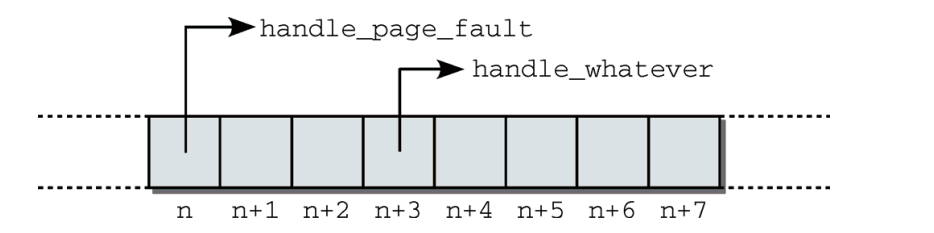
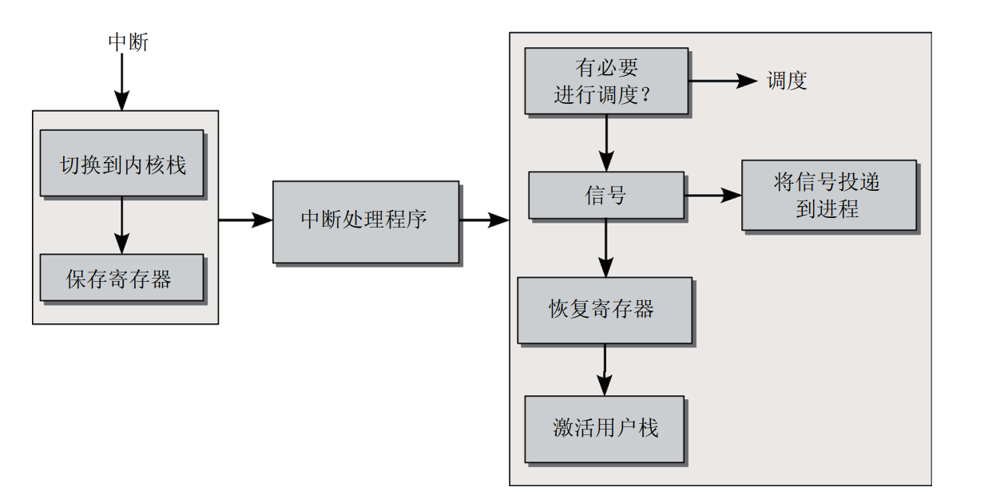

## 中断

### 中断类型

    中断可分为：1.同步中断和异常：这些由CPU自身产生，针对当前执行的程序。异常可能因种种原因触发：由于运行时发生的程序设计错误（典型的例子是除0），或由于出现了异常的情况或条件。异常典型的就是缺页异常。  2.异步中断：这是经典的中断类型，由外部设备产生，可能发生在任意时间

    如果触发中断时，当前cpu不在内核态，将会发起从用户态到内核态的切换，接下来会在内核中执行一个专门的程序：中断处理程序。

    在中断处理程序中，为了防止在中断中花费的时间过多，将中断分为两个部分，性能关键
的前一部分在禁用中断时执行，而不那么重要的后一部分延期执行，进行所有次要的操作。

### 硬件中断

    中断不能由处理器外部的外设直接产生，而必须借助于一个称为中断控制器(interrupt controller)的标准组件来请求，该组件存在于每个系统中。

    在CPU得知发生中断后，它将进一步的处理委托给一个软件例程，该例程可能会修复故障、提供专门的处理或将外部事件通知用户进程。由于每个中断和异常都有唯一的编号，内核使用一个数组，数组项是指向处理程序函数的指针。相关的中断号根据数组项在数组中的位置判断。    

    

    1.进入任务和退出任务

        中断处理划分为3部分。首先，必须建立一个适当的环境，使得处理程序函数能够在其中执行，接下来调用处理程序自身，最后将系统复原（在当前程序看来）到中断之前的状态。

        在进入核心态时，只保存整个寄存器集合的一部分。内核并不使用全部寄存器。举例来说，内核代码中不使用浮点操作（只有整数计算），因而并不保存浮点寄存器。浮点寄存器的值在执行内核代码时不会改变。
