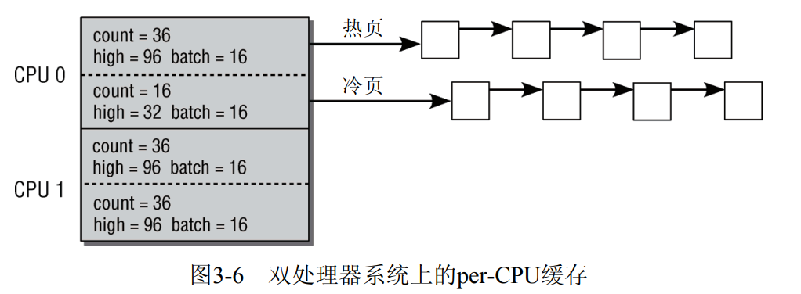
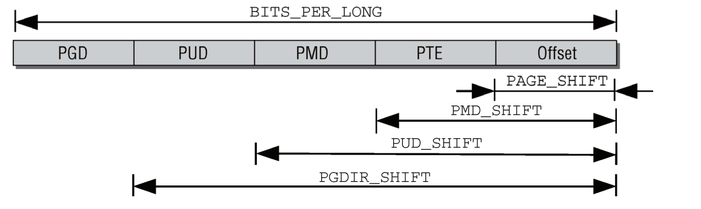
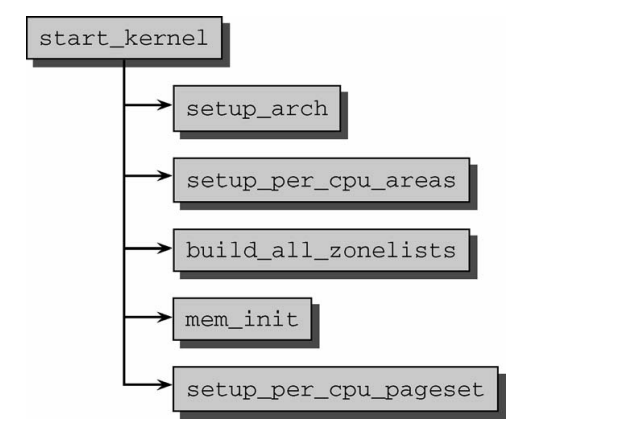
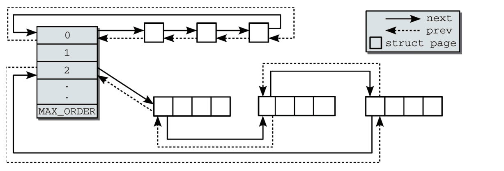
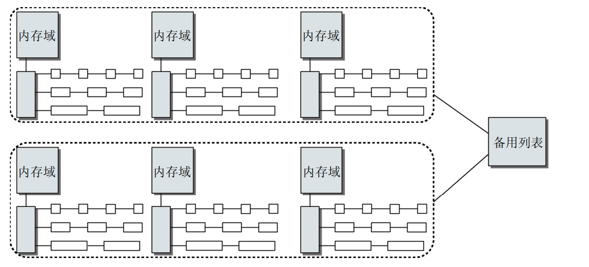

## 一.简介与概述

    在当前操作系统中存在两种泛型：

    微内核：只有最基本的功能由内核实现，其他的功能都委托给一些独立进程，这样内核的拓展性和层次性都获得了提升，但是最重要的问题是，这些组件的通信时间会大大提升，降低了内核的效率

    宏内核：内核的全部代码，包括子系统都打包到一个文件里，内核的每个函数都可以访问到内核中其他的部分，宏内核的性能是要强于微内核的。后面引入的模块机制，弥补了宏内核的拓展性。

### 进程

    在操作系统中有两种方法创建新的进程fork和exec

    fork：fork可以创建当前进程的一个副本，父进程和子进程只有PID（进程ID）不同。使用了**写时复制**技术使fork更高效，将内存复制操作延迟到父进程或子进程向内存写入数据时，在只读的情况下父进程和子进程公用一片内存。

    exec：将一个新程序加载到当前进程的内存中并执行。旧程序的内存页将刷出，其内容将替换为新的数据。然后开始执行新程序

    clone可以创建线程和进程·

### 物理内存分配

    采用伙伴系统（分裂和合并，适用大块内存）和slab分配器（小块内存）

    页面交换通过利用磁盘空间作为扩展内存，从而增大了可用的内存。在内核需要更多内存时，不经常使用的页可以写入硬盘，如果再需要访问相关数据，内核会将相应的页切换回内存。这步操作叫做缺页中断。 

### 计时

    内核使用jiffies计时，jiffies递增的频率同体系结构有关，取决于内核中一个主要的常数HZ

### 文件系统

    在面对各种各样的文件系统时，操作系统需要一个统一的接口去管理，在底层文件系统和应用层加了一个VFS层去统一接口。


所有的内核代码都必须是并发安全的。由于对多处理器计算机的支持，Linux内核代码必须
是可重入和线程安全的。也就是说，程序必须允许同时执行，而数据必须针对并行访问进行
保护

## 进程的调度与管理

    调度器的职责：1.内核必须决定为各个进程分配多长时间，何时切换到下一个进程。这又引出了哪个进程是下一个的问题  2.在内核从进程A切换到进程B时，必须确保进程B的执行环境与上一次撤销其处理器资源时完全相同

### 进程优先级

    进程可以分为两种：硬实时进程：系统必须保证进程的执行决不会超过某一时间范围。软实时进程

    进程的状态：运行，等待，睡眠，僵尸：在进程销毁时1.程序必须由另一个进程或一个用户杀死  2.进程的父进程在子进程终止时必须调用或已经调用wait4系统调用，当第一个条件成立，而第二个条件不成立时，进程就变成了僵尸进程

### 进程的表示

    linux的进程使用一个结构体task_struct描述：进程的状态和描述信息，进程的身份凭证，使用的文件包含程序代码的二进制文件，在与其他应用程序协作时所需的进程间通信有关的信息....。

    Linux提供资源限制（resource limit，rlimit）机制，对进程使用系统资源施加某些限制，维护了一个内容都是rlimit结构体的数组，rlimit结构体为：rlim_cur（当前使用的资源数量，也称之为软限制soft limit），rlim_max（最大使用的资源数量，也称之为硬限制hard limit）。要被限制的资源有：


### 命名空间

    namespace可以将一个或多个进程的资源隔离到同一个命名空间中，确保这些进程只能看到和操作该命名空间内的资源。处于不同namespace进程拥有独立的全局系统资源。修改某个 namespace中的资源（如网络、PID、文件系统等）只会影响该命名空间中的进程，不会影响其他命名空间中的进程。

    新的命名空间可以用下面两种方法创建：1. 在fork，clone创建新的进程时可以指定命名空间   2.unshare将当前进程从现有的命名空间中分离出来，并创建新的命名空间

    struct nsproxy用于汇集指向特定于子系统的命名空间包装器的指针：

```c
struct nsproxy { 
atomic_t count;                             
struct uts_namespace *uts_ns; 
struct ipc_namespace *ipc_ns; 
struct mnt_namespace *mnt_ns; 
struct pid_namespace *pid_ns; 
struct user_namespace *user_ns; 
struct net *net_ns; 
}; 
```

    UTS命名空间包含了运行内核的名称；保存在struct ipc_namespace中的所有与进程间通信有关的信息,已经装载的文件系统的视图，在struct mnt_namespace中给出；有关进程ID的信息，由struct pid_namespace提供；struct user_namespace保存的用于限制每个用户资源使用的信息；struct net_ns包含所有网络相关的命名空间参数。

    UTS命名空间存储了系统的名称（Linux...）、内核发布版本、机器名，等等

```c
struct new_utsname { 
char sysname[65]; 
char nodename[65]; 
char release[65]; 
char version[65]; 
char machine[65]; 
char domainname[65]; 
}; 
```

### 进程ID号

    UNIX进程总是会分配一个号码用于在其命名空间中唯一地标识它们。该号码被称作进程ID号，简称PID。处于某个线程组中的所有进程都有统一的线程组ID（TGID）。如果进程没有使用线程，则其PID和TGID相同。

    由于命名空间的关系，一个进程可能会具有多个pid，这里分为全局id和局部id：全局ID是在内核本身和初始命名空间中的唯一ID号，局部ID属于某个特定的命名空间，不具备全局有效性。对每个ID类型，它们在所属的命名空间内部有效，但类型相同、值也相同的ID可能出现在不同的命名空间中

## 进程复制

    在fork复制子进程时，使用写时复制，避免不必要的消耗。在创建新进程时，并不复制整个地址空间，而是只复制页表。

    在fork，vfork，clone都调用do_fork

### 内核线程

    内核线程是直接由内核本身启动的进程，也被称为守护进程。内核线程无法访问用户空间

### 线程的启动

    通过用新代码替换现存程序，即可启动新程序。Linux提供的execve系统调用可用于该目的

### 退出进程

    进程必须用exit系统调用终止。这使得内核有机会将该进程使用的资源释放回系统。简而言之，该函数的实现就是将各个引用计数器减1，如果引用计数器归0而没有进程再使用对应
的结构，那么将相应的内存区域返还给内存管理模块

### 调度器

    调度器的任务分为两个：合适的调度策略和进程调度的上下文转换。

    所有的可运行进程都按等待时间在一个红黑树中排序，等待cpu时间最长的进程是最左侧的叶子，调度器下次会考虑运行这个进程。

    系统的就绪队列都在runqueues数组中，数组中每个元素对应一个cpu，如果只有一个cpu的话数组中就只有一个元素。

    优先级：进程的nice值在20和+19之间（包含）。值越低，表明优先级越高。


## 三 内存管理

    有两种计算机，分别以不同的方式管理内存

    1.UMA计算机（一致性内存），将可用内存以连续方式组织起来


    2.NUMA计算机（非一致性内存），每个cpu都有自己的内存，可以快速访问，cpu也可以访问不属于自己的内存，但是访问速度会慢一些。 


    内存模型分为三种：平坦模型，不连续模型，稀疏模型。

    

### (N)UMA 模型中的内存组织

    在UMA系统上，只使用一个NUMA结点来管理整个系统内存。而内存管理的其他部分则相信它们是在处理一个伪NUMA系统。

    内存划分为节点，每个节点关联到系统的一个处理器，在内核中表示为pg_data_t的实
例，每个节点又划分为内存域，将内存进一步划分（在UMA系统上，对应的只有一个pg_data_t）,各个内存域都关联了一个数组，用来组织属于该内存域的物理内存页（内核中称之为页帧）。对每个页帧，都分配了一个struct page实例以及所需的管理数据。


pg_data_t是用于表示结点的基本元素:

```c
<mmzone.h> 
typedef struct pglist_data { 
struct zone node_zones[MAX_NR_ZONES]; 
struct zonelist node_zonelists[MAX_ZONELISTS]; 
int nr_zones; 
struct page *node_mem_map; 
struct bootmem_data *bdata; 
unsigned long node_start_pfn; 
unsigned long node_present_pages; /* 物理内存页的总数 */ 
unsigned long node_spanned_pages; /* 物理内存页的总长度，包含洞在内 */ 
int node_id; 
struct pglist_data *pgdat_next; 
wait_queue_head_t kswapd_wait; 
struct task_struct *kswapd; 
int kswapd_max_order; 
} pg_data_t; 
```

+ node_zones是一个数组，包含了结点中各内存域的数据结构

+ node_zonelists指定了备用结点及其内存域的列表，以便在当前结点没有可用空间时，在备用结点分配内存

+ 结点中不同内存域的数目保存在nr_zones

+ node_mem_map是指向page实例数组的指针，用于描述结点的所有物理内存页。它包含了结点中所有内存域的页

+ node_start_pfn是该NUMA结点第一个页帧的逻辑编号。系统中所有结点的页帧是依次编号的，每个页帧的号码都是全局唯一的。node_start_pfn在UMA系统中总是0，因为在UMA系统中只有一个节点，所以第一个页帧编号总是0

+ node_id是全局结点ID。系统中的NUMA结点都从0开始编号

+ pgdat_next连接到下一个内存结点，系统中所有结点都通过单链表连接起来，其末尾通过空指针标记

### 内存域

    内核使用zone结构来描述内存域

```c
struct zone { 
/*通常由页分配器访问的字段 */
unsigned long pages_min, pages_low, pages_high;
unsigned long lowmem_reserve[MAX_NR_ZONES];
struct per_cpu_pageset pageset[NR_CPUS];
/*
* 不同长度的空闲区域
*/
spinlock_t lock;
struct free_area free_area[MAX_ORDER];
ZONE_PADDING(_pad1_)
/* 通常由页面收回扫描程序访问的字段 */
spinlock_t lru_lock;
struct list_head active_list;
struct list_head inactive_list;
unsigned long nr_scan_active;
unsigned long nr_scan_inactive;
unsigned long pages_scanned; /* 上一次回收以来扫描过的页 */
unsigned long flags; /* 内存域标志，见下文 */
/* 内存域统计量 */
atomic_long_t vm_stat[NR_VM_ZONE_STAT_ITEMS];
int prev_priority;
ZONE_PADDING(_pad2_)
/* 很少使用或大多数情况下只读的字段 */
wait_queue_head_t * wait_table;
unsigned long wait_table_hash_nr_entries;
unsigned long wait_table_bits;
/* 支持不连续内存模型的字段。 */
struct pglist_data *zone_pgdat;
unsigned long zone_start_pfn;
unsigned long spanned_pages; /* 总长度，包含空洞 */
unsigned long present_pages; /* 内存数量（除去空洞） */
/*
* 很少使用的字段：
*/
 char *name;
} ____cacheline_maxaligned_in_smp; 
```

+ pages_min、pages_high、pages_low是页换出时使用的“水线”，如果内存不足，内核可
  以将页写到硬盘。如果空闲页多于pages_high，则内存域的状态是理想的；如果空闲页的数目低于pages_low，则内核开始将页换出到硬盘；如果空闲页的数目低于pages_min，那么页回收工作的压力就比较大，因为内存域中急需空闲页。

+ pageset是一个数组，用于实现每个CPU的热/冷页帧列表。内核使用这些列表来保存可用于满足实现的“新鲜”页。但冷热页帧对应的高速缓存状态不同：有些页帧也很可能仍然在高速缓存中，因此可以快速访问，故称之为热的；未缓存的页帧与此相对，故称之为冷的。

+ active_list是活动页的集合，而inactive_list则不活动页的集合（page实例）。

+ flags描述内存域的当前状态，有三种状态：
  
  ```c
  typedef enum {
  ZONE_ALL_UNRECLAIMABLE, /* 所有的页都已经“钉”住 */ 
  ZONE_RECLAIM_LOCKED, /* 防止并发回收 */ 
  ZONE_OOM_LOCKED, /* 内存域即可被回收 */ 
  } zone_flags_t; 
  ```
  
  ZONE_ALL_UNRECLAIMABLE:当用户程序使用mlock系统调用通知内核页不能从物理内存上移出，这样的页被称为钉住的。如果一个内存域中的所有页都被钉住，那么该内存域是无法回收的，即设置该标志。为不浪费时间，交换守护进程在寻找可供回收的页时，只会简要地扫描一下此类内存域。
  
  ZONE_RECLAIM_LOCKED：在SMP系统上，多个CPU可能试图并发地回收一个内存域。该标志可防止这种情况：如果一个CPU在回收某个内存域，则设置该标志。这防止了其他CPU的尝试。
  
  ZONE_OOM_LOCKED：用于某种不走运的情况：如果进程消耗了大量的内存，致使必要的操作都无法完成，那么内核会试图杀死消耗内存最多的进程，以获得更多的空闲页。该标志可以防止多个CPU同时进行这种操作。

+ 内存域和父结点之间的关联由zone_pgdat建立，zone_pgdat指向对应的pglist_data实例

+ zone_start_pfn是内存域第一个页帧的索引

### 冷热页

    struct zone的pageset成员用于实现冷热分配器（hot-n-cold allocator）。pageset是一个数组，其容量与系统能够容纳的CPU数目的最大值相同。

    数组元素的类型为per_cpu_pageset，定义如下：

```c
<mmzone.h> 
struct per_cpu_pageset {     
struct per_cpu_pages pcp[2]; /* 索引0对应热页，索引1对应冷页 */ 
} ____cacheline_aligned_in_smp; 
```

    该结构由一个带有两个数组项的数组构成，第一项管理热页，第二项管理冷页。具体的数据在per_cpu_pages中：

```c
<mmzone.h> 
struct per_cpu_pages { 
int count; /* 列表中页数 */ 
int high; /* 页数上限水印，在需要的情况下清空列表 */ 
int batch; /* 添加/删除多页块的时候，块的大小 */ 
struct list_head list; /* 页的链表 */ 
}; 
```

    count记录了与该列表相关的页的数目，high是一个水印。如果count的值超出了high，则表明列表中的页太多了。list是一个双链表，保存了当前CPU的冷页或热页，可使用内核的标准方法处理。如有可能，CPU的高速缓存不是用单个页来填充的，而是用多个页组成的块。batch是每次添加页数的一个参考值



### 页帧

    页帧代表系统内存的最小单位，对内存中的每个页都会创建struct page的一个实例。内核程序员需要注意保持该结构尽可能小，因为即使在中等程度的内存配置下，系统的内存同样会分解为大量的页。

    page的定义：

```c
struct page {        
    unsigned long flags; /* 用于描述页的属性，原子标志，有些情况下会异步更新 */ 
    atomic_t _count; /* 表示内核中引用该页的次数 */ 
    union { 
        atomic_t _mapcount; /* 内存管理子系统中映射的页表项计数，
        * 用于表示页是否已经映射，还用于限制逆向映射搜索。
        */ 
        unsigned int inuse; /* 用于SLAB分配器：对象的数目 */ 
    }; 
    union { 
        struct { 
            unsigned long private; /* 由映射私有，不透明数据：
            * 如果设置了PagePrivate，通常用于buffer_heads；
            * 如果设置了PageSwapCache，则用于swp_entry_t；
            * 如果设置了PG_buddy，则用于表示伙伴系统中的阶。
            */ 
            struct address_space *mapping; /* 如果最低位为0，则指向inode 
                * address_space，或为NULL。
                * 如果页映射为匿名内存，最低位置位，
                * 而且该指针指向anon_vma对象：
                * 参见下文的PAGE_MAPPING_ANON。
                 */ 
               }; 
... 
            struct kmem_cache *slab; /* 用于SLUB分配器：指向slab的指针 */ 
            struct page *first_page; /* 用于复合页的尾页，指向首页 */ 
    }; 
    union { 
        pgoff_t index; /* 在映射内的偏移量 */ 
        void *freelist; /* SLUB: freelist req. slab lock */ 
    }; 
    struct list_head lru; /* 换出页列表，例如由zone->lru_lock保护的active_list! 
    */ 
#if defined(WANT_PAGE_VIRTUAL) 
    void *virtual; /* 内核虚拟地址（如果没有映射则为NULL，即高端内存） */ 
#endif /* WANT_PAGE_VIRTUAL */ 
};
```

+ flags存储了体系结构无关的标志，用于描述页的属性。

+ _count是一个使用计数，表示内核中引用该页的次数。在其值到达0时，内核就知道page实例当前不使用，因此可以删除。如果其值大于0，该实例决不会从内存删除。

+ _mapcount表示在页表中有多少项指向该页

+ lru是一个表头，用于在各种链表上维护该页，以便将页按不同类别分组，最重要的类别是活动和不活动页。

+ 内核可以将多个毗连的页合并为较大的复合页（compound page）。分组中的第一个页称作首页（head page），而所有其余各页叫做尾页（tail page）。所有尾页对应的page实例中，都将first_page设置为指向首页。

### 与体系结构无关的页标志

    页的不同属性通过一系列页标志描述，存储为struct page的flags成员中的各个比特位，与体系结构有关的页标志保存在页表中而非 struct page中。

+ PG_locked指定了页是否锁定。如果该比特位置位，内核的其他部分不允许访问该页。这防止了内存管理出现竞争条件。

+ 如果在涉及该页的I/O操作期间发生错误，则PG_error置位。

+ PG_referenced和PG_active控制了系统使用该页的活跃程度。在页交换子系统选择换出页时，该信息是很重要的。

+ PG_uptodate表示页的数据已经从块设备读取，其间没有出错。

+ PG_dirty表示页是脏页，如果与硬盘上的数据相比，页的内容已经改变，则置位PG_dirty。出于性能考虑，页并不在每次改变后立即回写。因此内核使用该标志注明页已经改变，可以在稍后刷出。

+ PG_lru有助于实现页面回收和切换。内核使用两个最近最少使用（least recently used，lru）链表来区别活动和不活动页。如果页在其中一个链表中，则设置该比特位。

+ PG_highmem表示页在高端内存中，无法持久映射到内核内存中。

+ 如果页的内容处于向块设备回写的过程中，则需要设置PG_writeback位

+ 如果页是slab分配器的一部分，则设置PG_slab位

+ 如果页处于交换缓存，则设置PG_swapcache位。

+ 在可用内存的数量变少时，内核试图周期性地回收页，即剔除不活动、未用的页。在内核决定回收某个特定的页之后，需要设置PG_reclaim标志通知。

+ 如果页空闲且包含在伙伴系统的列表中，则设置PG_buddy位

+ PG_compound表示该页属于一个更大的复合页，复合页由多个相连的普通页组成。

### 页表

    页表用于向每个进程提供一致的虚拟地址空间。应用程序看到的地址空间是一个连续的内存区。该表也将虚拟内存页映射到物理内存，因而支持共享内存的实现（几个进程同时共享的内存），还可以在不额外增加物理内存的情况下，将页换出到块设备来增加有效的可用内存空间。页表管理分为两个部分，第一部分依赖于体系结构，第二部分是体系结构无关的。在后面以四级页表为例

    根据四级页表结构的需要，虚拟内存地址分为5部分（4个表项用于选择页，1个索引表示页内位置）。由于各个体系结构不仅地址字长度不同，而且地址字拆分的方式也不同，所以使用宏来拆分页表

    

#### 页表的格式

    内核提供了4个数据结构来表示页表项的结构

+ pgd_t用于全局页目录项

+ pud_t用于上层页目录项

+ pmd_t用于中间页目录项

+ pte_t用于直接页表项

    最后一级页表中的项不仅包含了指向页的内存位置的指针，还在上述的多余比特位包含了与页有关的附加信息。这些信息是和体系结构相关的：

+ PAGE_PRESENT指定了虚拟内存页是否存在于内存中

+ CPU每次访问页时，会自动设置_PAGE_ACCESSED。内核会定期检查该比特位，以确认页使用的活跃程度，在读或写访问之后会设置该比特位。

+ _PAGE_DIRTY表示该页是否是“脏的”，即页的内容是否已经修改过

+ 如果设置了_PAGE_USER，则允许用户空间代码访问该页。否则只有内核才能访问。

+ PAGE_READ、_PAGE_WRITE和_PAGE_EXECUTE指定了普通的用户进程是否允许读取、写入、执行该页中的机器代码（权限）

### 初始化内存管理

#### 建立数据结构

    对相关数据结构的初始化是从全局启动例程start_kernel中开始的，该例程在加载内核并激活各个子系统之后执行。由于内存管理是内核一个非常重要的部分，因此在特定于体系结构的设置步骤中检测内存并确定系统中内存的分配情况后，会立即执行内存管理的初始化。此时，已经对各种系统内存模式生成了一个pgdata_t实例，用于保存诸如结点中内存数量以及内存在各个内存域之间分配情况的信息。

    1.先决条件：内核在mm/page_alloc.c中定义了一个pg_data_t实例（称作contig_page_data）管理所有的系统内存。

    2.系统启动：图给出了start_kernel的代码流程图。其中只包括与内存管理相关的系统初始化函数



+ setup_arch是一个特定于体系结构的设置函数，其中一项任务是负责初始化自举分配器

+ 在SMP系统上，setup_per_cpu_areas初始化源代码中（使用per_cpu宏）定义的静态per-cpu变量，这种变量对系统中的每个CPU都有一个独立的副本。在非SMP系统上该函数是一个空操作。

+ build_all_zonelists建立结点和内存域的数据结构

+ mem_init是另一个特定于体系结构的函数，用于停用bootmem分配器并迁移到实际的内存管理函数

+ kmem_cache_init初始化内核内部用于小块内存区的分配器

+ setup_per_cpu_pageset从上文提到的struct zone，为pageset数组的第一个数组元素分配内存


3. 结点和内存域初始化：

        build_all_zonelists在当前处理的结点和系统中其他结点的内存域之间建立一种等级次序。接下来，依据这种次序分配内存。


### 物理内存的管理

#### 伙伴系统结构

    在zone中有struct free_area free_area[MAX_ORDER]，free_area如下：

```c
struct free_area {        
    struct list_head free_list[MIGRATE_TYPES];//用于连接空闲页的链表
    unsigned long nr_free;  //nr_free指定了当前内存区中空闲页块的数目
}; 
```

    nr_free指定了当前内存区中空闲页块的数目,free_list是用于连接空闲页的链表。

    阶是伙伴系统中一个非常重要的术语。它描述了内存分配的数量单位。内存块的长度是2^order，其中order的范围从0到MAX_ORDER。

    free_area[]数组中各个元素的索引也解释为阶，用于指定对应链表中的连续内存区包含多少个页帧。第0个链表包含的内存区为单页（2^0=1），第1个链表管理的内存区为两页（2^1=2），第3个管理的内存区为4页，依次类推。



    伙伴不必是彼此连接的。如果一个内存区在分配其间分解为两半，内核会自动将未用的一半加入到对应的链表中。如果在未来的某个时刻，由于内存释放的缘故，两个内存区都处于空闲状态，可通过其**地址**判断其是否为伙伴。

    伙伴系统的内存管理对象是某个节点的某个内存域，不同内存域之间的不共用一个伙伴系统



#### 避免碎片

    内存碎片（不连续的内存）对用户来说是无所谓的，因为用户的内存是通过页表映射的，无论如何，对于用户来说内存总是连续的。但对于内核来说，如果出现内存碎片，就无法拿到一块连续的大片内存。

    内核将已分配的页分为三类：

+ 不可移动页：在内存中有固定位置，不能移动到其他地方。内核分配的大多数内存属于该类别。

+ 可回收页：不能直接移动，但可以删除，其内容可以从某些源重新生成。例如，映射自文件的数据属于该类别

+ 可移动页可以随意地移动。属于用户空间应用程序的页属于该类别。它们是通过页表映射的。如果它们复制到新位置，页表项可以相应地更新，应用程序不会注意到任何事。
