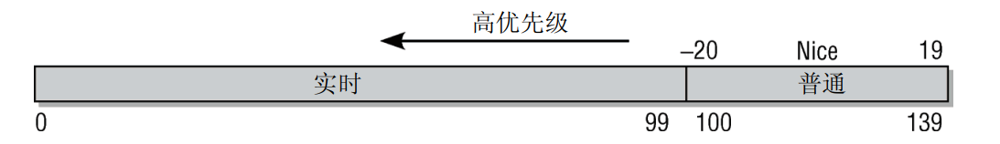

## 一.简介与概述

    在当前操作系统中存在两种泛型：

    微内核：只有最基本的功能由内核实现，其他的功能都委托给一些独立进程，这样内核的拓展性和层次性都获得了提升，但是最重要的问题是，这些组件的通信时间会大大提升，降低了内核的效率

    宏内核：内核的全部代码，包括子系统都打包到一个文件里，内核的每个函数都可以访问到内核中其他的部分，宏内核的性能是要强于微内核的。后面引入的模块机制，弥补了宏内核的拓展性。

### 进程

    在操作系统中有两种方法创建新的进程fork和exec

    fork：fork可以创建当前进程的一个副本，父进程和子进程只有PID（进程ID）不同。使用了**写时复制**技术使fork更高效，将内存复制操作延迟到父进程或子进程向内存写入数据时，在只读的情况下父进程和子进程公用一片内存。

    exec：将一个新程序加载到当前进程的内存中并执行。旧程序的内存页将刷出，其内容将替换为新的数据。然后开始执行新程序

    clone可以创建线程和进程·

### 物理内存分配

    采用伙伴系统（分裂和合并，适用大块内存）和slab分配器（小块内存）

    页面交换通过利用磁盘空间作为扩展内存，从而增大了可用的内存。在内核需要更多内存时，不经常使用的页可以写入硬盘，如果再需要访问相关数据，内核会将相应的页切换回内存。这步操作叫做缺页中断。 

### 计时

    内核使用jiffies计时，jiffies递增的频率同体系结构有关，取决于内核中一个主要的常数HZ

### 文件系统

    在面对各种各样的文件系统时，操作系统需要一个统一的接口去管理，在底层文件系统和应用层加了一个VFS层去统一接口。


所有的内核代码都必须是并发安全的。由于对多处理器计算机的支持，Linux内核代码必须
是可重入和线程安全的。也就是说，程序必须允许同时执行，而数据必须针对并行访问进行
保护

## 进程的调度与管理

    调度器的职责：1.内核必须决定为各个进程分配多长时间，何时切换到下一个进程。这又引出了哪个进程是下一个的问题  2.在内核从进程A切换到进程B时，必须确保进程B的执行环境与上一次撤销其处理器资源时完全相同

### 进程优先级

    进程可以分为两种：硬实时进程：系统必须保证进程的执行决不会超过某一时间范围。软实时进程

    进程的状态：运行，等待，睡眠，僵尸：在进程销毁时1.程序必须由另一个进程或一个用户杀死  2.进程的父进程在子进程终止时必须调用或已经调用wait4系统调用，当第一个条件成立，而第二个条件不成立时，进程就变成了僵尸进程

### 进程的表示

    linux的进程使用一个结构体task_struct描述：进程的状态和描述信息，进程的身份凭证，使用的文件包含程序代码的二进制文件，在与其他应用程序协作时所需的进程间通信有关的信息....。

    Linux提供资源限制（resource limit，rlimit）机制，对进程使用系统资源施加某些限制，维护了一个内容都是rlimit结构体的数组，rlimit结构体为：rlim_cur（当前使用的资源数量，也称之为软限制soft limit），rlim_max（最大使用的资源数量，也称之为硬限制hard limit）。要被限制的资源有：


### 命名空间

    namespace可以将一个或多个进程的资源隔离到同一个命名空间中，确保这些进程只能看到和操作该命名空间内的资源。处于不同namespace进程拥有独立的全局系统资源。修改某个 namespace中的资源（如网络、PID、文件系统等）只会影响该命名空间中的进程，不会影响其他命名空间中的进程。

    新的命名空间可以用下面两种方法创建：1. 在fork，clone创建新的进程时可以指定命名空间   2.unshare将当前进程从现有的命名空间中分离出来，并创建新的命名空间

    struct nsproxy用于汇集指向特定于子系统的命名空间包装器的指针：

```c
struct nsproxy { 
atomic_t count;                             
struct uts_namespace *uts_ns; 
struct ipc_namespace *ipc_ns; 
struct mnt_namespace *mnt_ns; 
struct pid_namespace *pid_ns; 
struct user_namespace *user_ns; 
struct net *net_ns; 
}; 
```

    UTS命名空间包含了运行内核的名称；保存在struct ipc_namespace中的所有与进程间通信有关的信息,已经装载的文件系统的视图，在struct mnt_namespace中给出；有关进程ID的信息，由struct pid_namespace提供；struct user_namespace保存的用于限制每个用户资源使用的信息；struct net_ns包含所有网络相关的命名空间参数。

    UTS命名空间存储了系统的名称（Linux...）、内核发布版本、机器名，等等

```c
struct new_utsname { 
char sysname[65]; 
char nodename[65]; 
char release[65]; 
char version[65]; 
char machine[65]; 
char domainname[65]; 
}; 
```

### 进程ID号

    UNIX进程总是会分配一个号码用于在其命名空间中唯一地标识它们。该号码被称作进程ID号，简称PID。处于某个线程组中的所有进程都有统一的线程组ID（TGID）。如果进程没有使用线程，则其PID和TGID相同。

    由于命名空间的关系，一个进程可能会具有多个pid，这里分为全局id和局部id：全局ID是在内核本身和初始命名空间中的唯一ID号，局部ID属于某个特定的命名空间，不具备全局有效性。对每个ID类型，它们在所属的命名空间内部有效，但类型相同、值也相同的ID可能出现在不同的命名空间中

## 进程复制

    在fork复制子进程时，使用写时复制，避免不必要的消耗。在创建新进程时，并不复制整个地址空间，而是只复制页表。

    在fork，vfork，clone都调用do_fork

### 内核线程

    内核线程是直接由内核本身启动的进程，也被称为守护进程。内核线程无法访问用户空间

### 线程的启动

    通过用新代码替换现存程序，即可启动新程序。Linux提供的execve系统调用可用于该目的

### 退出进程

    进程必须用exit系统调用终止。这使得内核有机会将该进程使用的资源释放回系统。简而言之，该函数的实现就是将各个引用计数器减1，如果引用计数器归0而没有进程再使用对应
的结构，那么将相应的内存区域返还给内存管理模块

### 调度器

    调度器的任务分为两个：合适的调度策略和进程调度的上下文转换。

    所有的可运行进程都按等待时间在一个红黑树中排序，等待cpu时间最长的进程是最左侧的叶子，调度器下次会考虑运行这个进程。

    系统的就绪队列都在runqueues数组中，数组中每个元素对应一个cpu，如果只有一个cpu的话数组中就只有一个元素。

    优先级：进程的nice值在20和+19之间（包含）。值越低，表明优先级越高。




## 内存管理

    有两种计算机，分别以不同的方式管理内存

    1.UMA计算机（一致性内存），将可用内存以连续方式组织起来


    2.NUMA计算机（非一致性内存），每个cpu都有自己的内存，可以快速访问，cpu也可以访问不属于自己的内存，但是访问速度会慢一些。 


    内存模型分为三种：平坦模型，不连续模型，稀疏模型。

    

### (N)UMA 模型中的内存组织

    在UMA系统上，只使用一个NUMA结点来管理整个系统内存。而内存管理的其他部分则相信它们是在处理一个伪NUMA系统。

    内存划分为节点，每个节点关联到系统的一个处理器，在内核中表示为pg_data_t的实
例，每个节点又划分为内存域，将内存进一步划分（在UMA系统上，对应的只有一个pg_data_t）,各个内存域都关联了一个数组，用来组织属于该内存域的物理内存页（内核中称之为页帧）。对每个页帧，都分配了一个struct page实例以及所需的管理数据。


pg_data_t是用于表示结点的基本元素:

```c
<mmzone.h> 
typedef struct pglist_data { 
struct zone node_zones[MAX_NR_ZONES]; 
struct zonelist node_zonelists[MAX_ZONELISTS]; 
int nr_zones; 
struct page *node_mem_map; 
struct bootmem_data *bdata; 
unsigned long node_start_pfn; 
unsigned long node_present_pages; /* 物理内存页的总数 */ 
unsigned long node_spanned_pages; /* 物理内存页的总长度，包含洞在内 */ 
int node_id; 
struct pglist_data *pgdat_next; 
wait_queue_head_t kswapd_wait; 
struct task_struct *kswapd; 
int kswapd_max_order; 
} pg_data_t; 
```

+ node_zones是一个数组，包含了结点中各内存域的数据结构

+ node_zonelists指定了备用结点及其内存域的列表，以便在当前结点没有可用空间时，在备用结点分配内存

+ 结点中不同内存域的数目保存在nr_zones

+ node_mem_map是指向page实例数组的指针，用于描述结点的所有物理内存页。它包含了结点中所有内存域的页

+ node_start_pfn是该NUMA结点第一个页帧的逻辑编号。系统中所有结点的页帧是依次编号的，每个页帧的号码都是全局唯一的。node_start_pfn在UMA系统中总是0，因为在UMA系统中只有一个节点，所以第一个页帧编号总是0

+ node_id是全局结点ID。系统中的NUMA结点都从0开始编号

+ pgdat_next连接到下一个内存结点，系统中所有结点都通过单链表连接起来，其末尾通过空指针标记
