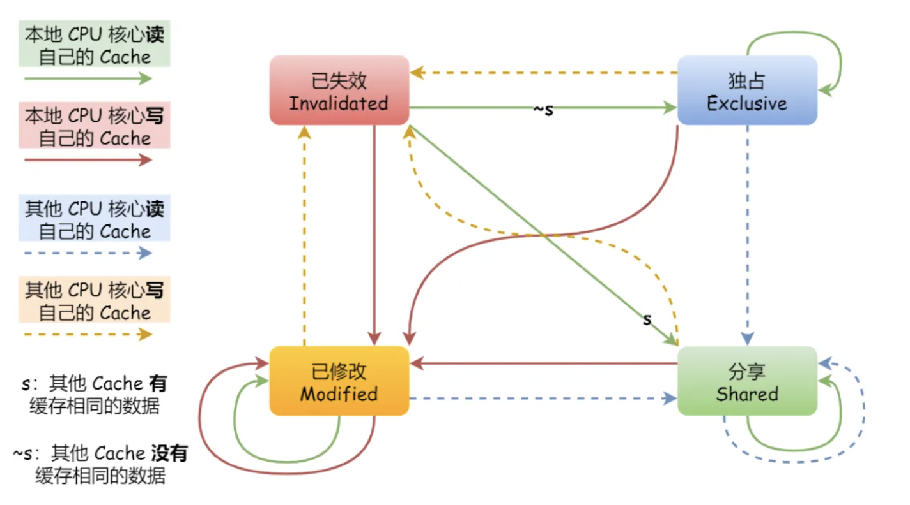
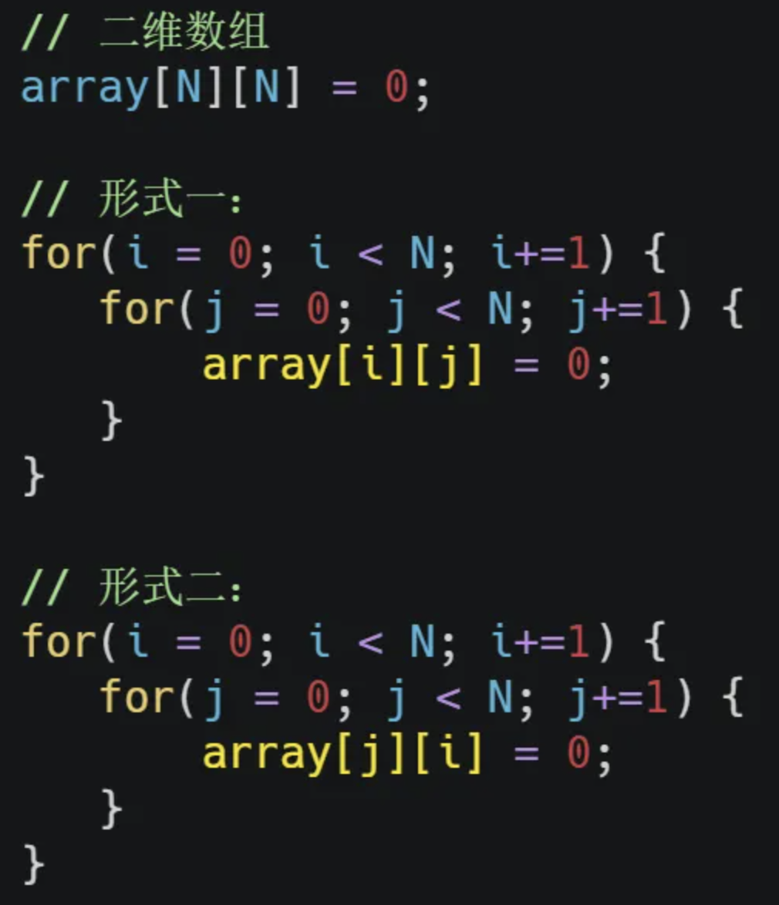

# c语言

## 1. 柔性数组

    在linux中一些结构体中可以看到这样的定义

```c
struct vring_avail {
    __virtio16 flags;
    __virtio16 idx;
    __virtio16 ring[];
};
```

   可以看到这里的ring数组是没有长度的，这个就是柔性数组，柔性数组在没有分配内存的时候不占内存的，例如

```c
#include<stdio.h>

struct vring
{
        int num;
        int a[];
};

int main()
{
        int n=sizeof(struct vring);
        printf("%d\r\n",n);
        return 0;
}
```

    这里sizeof打印出来只有4，是num的大小，如果要给数组分配大小这样分配

```c
struct vring *v = malloc(sizeof(struct vring) + 10 * sizeof(int));
```

    注意声明柔性数组只能在结构体的最后声明

[C语言0长度数组(可变数组/柔性数组)详解_零长数组使用-CSDN博客](https://blog.csdn.net/gatieme/article/details/64131322)


## 2.内存对齐


# 操作系统

## 1.大页

    正常来说我们的页表管理的最小单位是4k。如果某个业务恒定的需要大内存或者对延迟较敏感的场景，可以使用大页机制。

    以四级页表为例，我们可以在第三级或者第二级中就引出pte，假如在第二级页表中引出，一个页的大小就是1G，从三级页表中引出，一个页大小就是2MB。

    那么这个时候就有人要问了，主播主播大页有什么好处，为什么要开大页，用4kb不行吗？这个问题可以从以下几个方面来考虑

    1）同样使用1GB的物理内存，如果使用传统页表，我们就会有1GB / 4KB = 262144页，每个pte占8b，那么pte就要占262144×8B=2MB，再加上三级页表的页目录项，大约就是2mb，但是用1GB大页就只用8b，如果在物理内存特别大的机器上使用大页，就可以省下很多内存了。

    2）减少tlb miss，提高内存访问速度

    3）小页更容易触发缺页中断，大页减少了中断频率

## 2.TLB

    TLB的存在是为了缓存虚拟地址->物理地址，减少转换工序，提供速率。
    
    不同的进程会对应相同的虚拟地址，在tlb中是如何区分的？

    在tlb中包含了ASID，这个ASID就可以标识当前的虚拟地址->物理地址是属于哪个进程的，每个进程有唯一的一个ASID。

关于锁的知识

## 3.并发相关

### 竞争与协作

#### 并发

    什么是并发？在单核cpu系统中，为了让多个进程一起运行，就为每个进程分配了时间片，大家轮流使用，造成这些进程一起运行的假象，可以说并发就是在**一段**时间内运行多个程序。

    先抛出一个问题：多线程处理器+1问题

    让两个线程同时对一个全局变量进行+1，最后得出的结果会小于总数，即使+1的操作换成汇编指令的add，只使用一条指令执行+1操作，结果也是不一样的

```c
#include <stdio.h>
#include <pthread.h>

// 共享变量
int counter = 0;

// 线程函数：对counter执行100000次+1操作
void* increment(void* arg) {
    for (int i = 0; i < 100000; i++) {
        counter++; // 非原子操作，可能导致竞态条件
    }
    return NULL;
}

int main() {
    pthread_t thread1, thread2;

    // 创建两个线程
    pthread_create(&thread1, NULL, increment, NULL);
    pthread_create(&thread2, NULL, increment, NULL);

    // 等待两个线程执行完毕
    pthread_join(thread1, NULL);
    pthread_join(thread2, NULL);

    // 输出结果
    printf("counter = %d\n", counter);

    return 0;
}
```

    原因是counter++操作是不原子的，假设第一个线程将counter读入，在++后还没有写到内存时，被调度出去让第二个线程运行，这时第二个线程读到的值就是不对的，所以在一直发生这种情况之后，结果自然要比正确值小。

#### 互斥

    上面发生的叫竞争条件，多线程操作共享变量的这段代码可能会导致竞争条件，这段代码被称为临界区，临界区是不能让多线程同时执行的。我们会希望这段代码是互斥的，可以保证同时只有一个线程在临界区执行，其他线程应该被组织进去临界区。

#### 同步

    虽然在多个线程执行时会出现互斥的问题，但是他们也可以共同合作。假如一个线程负责读数据，另一个线程负责处理数据，这时我们就希望他们两个可以共同合作。在第一个线程没有可读数据时，第二个线程就可以阻塞等待；当第一个线程读到数据时，就去唤醒第二个线程，告诉第二个线程该干活了，并把第一个线程的数据交给第二个线程。同步就是某些进程需要阻塞等待另一些进程的资源，有资源的话会唤醒需要资源的进程干活。

    同步是 A操作需要在B操作之后才能执行
    互斥是 A和B不能在同一时刻执行

#### 同步和互斥的实现和使用

    操作系统提供了两种机制

- 锁：加锁、解锁操作

- 信号量：P、V操作

    锁只可以实现互斥，信号量可以实现互斥和同步。

    锁在下面会说

    信号量通常表示资源的数量，对应的变量是一个整型（sem）变量，且有两个原子操作的系统调用函数来控制信号量。

- P操作：将sem--，如果在--后sem<0，则进入阻塞等待

- V操作：将sem++，如果在++之后sem<=0，则唤醒一个等待中的进程/线程。

    

    上面说到，信号量既可以实现互斥也能实现同步，如何用信号了实现互斥操作的？可以设置信号量的初值为1，保证进入临界区前调用P操作，在退出临界区时调用V操作。

    信号量实现同步也很简单，需要处理数据的调用P操作，负责读数据的调用V操作就可以了

#### 生产者-消费者问题

    问题是这样的：有一个缓冲区，生产者生产后的数据放进去，消费者从这个缓冲区读出数据处理，任何时刻，只能有一个生产者或者消费者能访问这个缓冲区。

    分析如下：
    1）因为任何时刻只有一个进程能访问缓冲区，说明操作缓冲区是临界代码，需要互斥。

    2）缓冲区空的时候，消费者需要等待生产者生产数据；缓冲区满的时候，生产者需要等待消费者消费数据

    那么我们需要三个信号量：

    1）第一个信号量mutex用于实现对缓冲区的互斥访问，初始值为1

    2）第二个信号量用于消费者询问缓冲区是否有数据，初始值为0

    3）第三个信号量用于生产者询问缓冲区是否有空位，初始值为n（缓冲区的大小）


#### 哲学家就餐问题

    现在有5个哲学家，围着一张桌子，这个桌子有5把叉子，每两个哲学家中间放一把叉子，当哲学家思考饿了的时候，就会开始进餐，但是哲学家需要同时拿两个叉子才能进餐，当进餐完毕之后，会把叉子放回原处。

    

    如果哲学家们进餐顺序有问题，就会出现有人永远拿不到叉子，吃不了饭

    一个思路：可以把拿左右两把叉子的操作用锁保护起来，让拿左右两把叉子是原子操作，要么把左右两把叉子一起拿了，要么一个也拿不到

### 各种锁的区别

    首先明确一点，锁的存在是为了保护共享变量，是为了防止多个线程操作同一个变量，造成数据不一致的问题。可以理解为机组学过的：写后读，读后写，写后写问题。如果你发现同时有多个线程会操作（读/写）同一个变量的时候，就要提高警惕，考虑要不要用锁。

#### 自旋锁和互斥锁

    最底层的是自选锁和互斥锁，当有一个进程加锁的时候，另一个进程尝试加锁就会失败，失败后的操作就是自选锁和互斥锁的区别。

- 自旋锁在加锁失败之后，线程就会忙等待，直到他拿到锁

- 互斥锁加锁失败之后，就会睡眠（schedule主动调度出去），等待下一次唤醒再尝试拿锁

    互斥锁在加锁失败时，由于需要schedule，所以会从用户态陷入到内核态，让内核去切换线程，会增加性能的开销。

    而自旋锁使用CAS（cmpxchg原子操作），在用户态完成加锁和解锁操作，不会主动产生线程上下文切换

    ps1：用户态自旋锁有两种：
    1）：纯用户态自旋锁（pthread_spinlock_t等），由glibc提供的
    2）：内核提供的futex

    ps2：内核态：为什么自旋锁的实现形式就是while循环去等待锁，但是如果等的太久，时间片被用完之后还不会被切换出去？因为申请自旋锁的时候preempt_disable关了抢占，哪怕时间片用完，也也只会设置 TIF_NEED_RESCHED，而不会立即调用 schedule()。当拿到锁之后才会打开抢占。

```c
void __lockfunc __raw_##op##_lock(locktype##_t *lock)            \
{                                    \
    for (;;) {                            \
        preempt_disable();                    \
        if (likely(do_raw_##op##_trylock(lock)))        \
            break;                        \
        preempt_enable();                    \
                                    \
        arch_##op##_relax(&lock->raw_lock);            \
    }                                \
}                                    \
```

    ps3：单核场景下自旋锁是没有意义的，只有一个核你自选等待，是指望谁给你释放锁呢？退一步来说，假设你开了抢占，别的进程可以抢占等待锁的进程，那这么做和mutex的开销就差不多了，spinlock的初衷是尽量不切进程就可以拿到锁，在单核场景下，即使开了抢占，切进程也是必然的。

    之前面试官问过我一个问题：在提及自旋锁的时候我说自选锁是忙等待，面试官就问我说忙等待指的是什么，我说是while(1)一直等待直到锁释放为止（那个时候其实我没有搞清楚用户态的自旋锁和内核态的自选锁的区别），他就问我那你用户态写一个while（1）难道会说卡死在这里吗？ 确实给我问住了，既然是在用户态执行的代码只要你 不陷入内核态，就不可能做到一直保持running状态，但是如果能被调度出去那为什么叫自选锁，只是主动睡眠和被动睡眠的区别，意义在哪？

    解答：
    1）忙等待在这里要区分场景来看：如果是内核的自选锁，忙等待就是真正while（1），因为这里是关了抢占的。为什么要关抢占?如果不关抢占在拿到锁之后被切出去，这里临界区执行不完释放不了锁，会导致锁竞争恶化，不如把抢占关了，尽快执行完临界区的好释放锁；如果是用户态的自选锁，忙等待就不是真正的while（1）了，在时间片耗尽时，依然会被调度出去。（其实这里的while1是pause指令，理解为低功耗模式吧～）

    2）在用户态也会被调度出去的自选锁 意义在哪？因为互斥锁的schedule是有代价的，代价就是两次切换上下文的消耗，而spinlock的代价就是等待前面释放锁的时间，所以你要算一笔账，到底是 mutex两次消耗大还是等待这个锁消耗的时间大。在锁竞争激烈的情况下可以使用mutex，不激烈的情况下使用spinlock。

#### 读写锁

    读写锁将读写分开了，读资源用读锁，写资源用写锁。在没有写的情况下，多个线程可以并发持有读锁去读取。但是有写锁时，读线程获取锁的操作会被阻塞，并且其他写进程也会被阻塞。任何时候只能有一个进程拿读锁。在读多写少的场景下可以发挥优势。

    按照优先级可以被分为读者优先和写者优先：

    1）读者优先就是，现在很多个锁已经拿到了读锁正在读数据，这个时候有写锁申请写数据，之后又有读者申请读数据，就会让这个读者先读，直到读锁持有数量为0时，才允许写锁
    2）写者优先就是，现在已经在写了，后面来了一些读者申请读锁，之后又来了写锁，要让所有的写锁都写完才允许读。

    3）还有一种公平读写锁，就是按照申请锁的时间，用队列把获取锁的线程排队，所有读写线程先进先出。

### 乐观锁和悲观锁的区别

    上面说到的自旋锁、互斥锁、读写锁都属于悲观锁。悲观锁就是他认为多个线程操作同一个资源的概率比较高，所以在操作之前必须加锁，他的看法比较悲观。

    而乐观锁相反，他认为多个线程操作同一个资源的概率很低，所以不必在操作共享变量时加锁。先修改变量，再去验证这段时间内有没有冲突，如果没有冲突这次修改就是完成的；如果有冲突就放弃这次修改。放弃后如何重试，这跟业务场景息息相关，虽然重试的成本很高，但是冲突的概率足够低的话，还是可以接受的。在线共享文档和git等就是用的乐观锁。如果共享文档使用悲观锁，那么同时只有一个用户能打开文档，那肯定是不能接受的。

### 优先级翻转问题

## 4.进程与线程

    当进程中其中一个线程崩溃时，会导致所属进程的所有线程崩溃


    进程与线程的区别：

- 进程是资源分配的单位，线程是cpu调度的单位

- 进程拥有完整的资源，线程只独享必不可少的资源（寄存器和栈）

- 线程同样具有就绪、阻塞、执行三种状态

- 线程能减少并发执行的时间和空间开销


    为什么线程和进程相比可以减少开销？

- 进程的创建涉及到资源的分配，但是创建线程只需要共享进程的资源就可以；同样的，在销毁的时候，线程释放的资源只有独享的部分，但是进程就要释放所有资源。

- 同一个进程内的线程切换比进程之间切换要快，因为在同一个进程内的线程切换不涉及到页表的切换，不同进程切换是要换页表的。

- 同一个进程内的线程是共享内存和文件的，不用再做额外操作。


    线程的上下文切换开销：

- 如果是两个不同进程的线程切换，开销和进程切换开销一样大

- 如果是同一个进程的两个线程，只用切换线程的私有数据（寄存器，栈）


    线程独占哪些资源？共享哪些资源？

    独占：1）线程自己的栈。 2）线程上下文（涉及调度的寄存器）

    共享：1）代码区：进程中任何一个函数都可以被放到线程里执行，说明线程是共享代码段的。  2）数据区：每个线程都可以访问全局变量。   3）堆区：在进程内任意地方（包括线程内）malloc的数据，只要知道这个变量的地址，就可以在任意一个线程那访问。4）栈区：虽然说每个线程的栈是自己独享的，但是这并不像进程有页表隔离可以保证不访问到其他进程。线程是没有这一层的保护机制的，也就是说只要在一个线程中可以拿到另一个线程的变量的地址，也是可以修改的。   5）动态链接库：如果一个程序是动态链接起来的，那么elf文件中会留有给动态链接库的位置，所有线程都可以使用这个动态链接库。 6）打开的文件。 

    需要注意的是，可以在进程中使用__thread修饰全局变量，这个关键字修饰的全局变量就会变成线程的局部变量。

```c
// 线程局部变量：每个线程有独立的副本
__thread int thread_local_var = 0;

void* thread_func(void* arg) {
    thread_local_var = 0；
    printf("地址: %p\n", &thread_local_var);
    return NULL;
}
```

    如果创建多个线程，可以观察到不同线程的地址是不一样的，说明thread_local_var这个变量是线程独享的。


    调度算法分为两类：

- 非抢占式调度：运行的进程除非自己阻塞或者自己退出，才会调用别的进程运行，否则会一直运行，不理会时钟中断

- 抢占式调度：被运行的进程只能运行一段时间，如果过了这个时间还在运行，调度器会把他挂起，让别的进程运行。也叫时间片机制

## 5.软中断

    中断被分为上下半部，上半部由硬件处理，下半部分交给软中断处理。所以我们说的硬中断也就是中断上半部，软中断就是中断下半部

    更多关于软中断的看这里：[note/内核各个子模块/中断下半部 at master · kayle7c/note · GitHub](https://github.com/kayle7c/note/tree/master/%E5%86%85%E6%A0%B8%E5%90%84%E4%B8%AA%E5%AD%90%E6%A8%A1%E5%9D%97/%E4%B8%AD%E6%96%AD%E4%B8%8B%E5%8D%8A%E9%83%A8)[note/内核各个子模块/中断下半部 at master · kayle7c/note · GitHub](https://github.com/kayle7c/note/tree/master/%E5%86%85%E6%A0%B8%E5%90%84%E4%B8%AA%E5%AD%90%E6%A8%A1%E5%9D%97/%E4%B8%AD%E6%96%AD%E4%B8%8B%E5%8D%8A%E9%83%A8)

    之前面试官问过我一个问题：软中断执行的时候可以被硬中断打断吗？当然是可以的，软中断一般都是交给内核线程ksoftirqd执行的，内核线程当然可以被硬件中断打断

    硬件中断是不可以被嵌套的（优先级高也不行），为了防止中断过于多的时候爆栈

## 6.CFS调度策略

    通过vruntime衡量进程对cpu的消耗，优先调度vruntime最小的进程。
    vruntime+=实际运行时间（time process run) * 1024 / 进程权重(load weight of this process)，优先级高（nice值小）的进程在实际运行时间转换到虚拟运行时间时会被压缩，可以得到更多的运行时间；相反优先级低（nice值大）的进程在实际运行时间转换到虚拟运行时间时会被放大。这个vruntime是对整个系统来说的，而不是单cpu，同一个进程在多个cpu上运行的时间会累加。

    CFS使用红黑树存储runqueue（可运行进程），按照每个进程的vruntime排序。CFS会维护一个指针，每次都指向红黑树最左边的节点（vruntime最小的）。


## 7.malloc系统调用

    这里不谈glibc为了减少陷入内核的内存池机制，只说malloc陷入内核是怎么处理的

    如果申请的内存大小 小于 128kb时，会使用系统调用brk()或者sbrk()，这时分配的内存是在堆区的。brk是把堆区指针放到指定位置，sbrk是把堆区指针向后移动指定字节。其实就是分配完内存之后调整堆的大小。但是这样先分配的内存会被后分配的内存压在下面，想释放这块内存必须把它上面的内存释放掉，这时候glibc的内存池就起作用了

    如果申请的内存 大于 128kb时，会使用系统调用mmap，在进程映射区映射一片虚拟内存空间。详见：[note/内核各个子模块/内存相关/内存相关.md at master · kayle7c/note · GitHub](https://github.com/kayle7c/note/blob/master/%E5%86%85%E6%A0%B8%E5%90%84%E4%B8%AA%E5%AD%90%E6%A8%A1%E5%9D%97/%E5%86%85%E5%AD%98%E7%9B%B8%E5%85%B3/%E5%86%85%E5%AD%98%E7%9B%B8%E5%85%B3.md)的虚拟内存mmap部分
    注意，不管是brk还是mmap，申请到的内存都是进程虚拟地址空间上的堆或映射区，和物理内存无关，只有缺页时才会分配

## 8.零拷贝


## 9.缺页中断


## 10.可执行文件是如何装载进虚拟内存的

    execve


## 10.进程虚拟地址空间的分布


+ 映射区：动态库、mmap映射文件和mmap分配大块内存会在这个地方


## 共享内存和内存映射区别


# 其他

## 1.cache一致性以及MESI协议

    cache是cpu和内存的中介，在有了cache之后，cpu的读写数据都走cache，不直接和内存交互。在单核系统下，cpu要读数据时，会从内存中读取想读的数据和附近的数据（一致性原理）读到cache中，cpu再从cache中拿；同理cpu要写数据时也是先将新数据写到cache中（如果cache中没有该数据，就先读再写），再更新到内存中。这在单核场景下看起来并没有问题，但是如果是多个cpu，同时读取了数据a=0，cpu1想更改a+=1，更改完之后并没有写回到内存中，此时cpu2也想更改a+=1，本来这两波操作下来a应该是2，但是这样操作a就是1了，明显有问题。

    对于cpu写数据有两种写回方法：

    1）写直达：这种方法可以保证cache与内存的一致性，在cpu写数据的时候，同时把数据写入cache和内存中，但是这种方法会频繁的写内存，性能肯定不佳

    2）写回：如果想要提升性能，肯定要想办法尽可能少的写内存，具体策略是这样的。如果要更新数据时，该数据还在cache中，则把该部分cache标记为dirty，说明cache和内存是不一致的；如果该数据对应的cache block已经被替换掉了，就看替换掉的数据是不是dirty的，如果是就把这个数据写回到内存里去，再把要写的数据写入到到这个cache block，吧之前那个数据替换掉，如果替换的数据不是dirty，那就直接覆盖。总之：当前写的数据永远不会写回，写回的只是替换了原本写的数据的位置数据（为dirty情况下）。

    

    为了解决上面说到的问题就要保证两点：

    1）当某个cpu cache数据更新时，必须要传播到其他cpu 的cache中去，这个叫写传播

    2）某个 CPU 核心里对数据的操作顺序，必须在其他核心看起来顺序是一样的，这个称为事务的串形化

    第二点说的是，假如abcd cache上同时有变量x，初始都为0，a和b同时修改x=100和x=200，在写传播过程中，c可能先看到x=100再看到x=200，那么c就认为c=200，但是d先看到x=200再看到x=100，d就认为d=100。所以就有问题。    

    所以在写传播的过程中，需要拿“锁”，保证其他cpu cache看到的更新顺序一定是相同的

### MESI协议

    MESI协议说的是四个状态：标记 Cache Line 四个不同的状态

+ Modified 已修改：脏标记，已经修改了cache中的数据但是没有同步到内存中

+ Exclusive 独占： Cache Block 里的数据是干净且这个数据里只有当前cpu cache中存在，更改之后可以不通知其他cpu

+ Shared 共享：Cache Block 里的数据是干净且其他cpu cache中也有这个数据，如果更改了必须通知其他cpu。

+ Invalidated 已失效：通过总线嗅探发现cache发现这个 Cache Block已经被更改了，不可以读取这个数据

    这个就是整个状态机的状态转移图，其实这里主要解决两个问题：一个是上面说的事物串型化问题，还有一个就是不用在每次更新数据都让发送给其他cpu，让其他cpu一直检测这个状态，优化了这个过程。



    一些其他cache的知识：cache的组织方式是以cache cline的形式组织的，在cpu发现cache中没有想要的数据时，会从内存中读，不只是读自己想要的数据，而是一次读一批数据，这一批数据就是一个cache cline。从局部性原理来看，读的这一批cache cline就是要读的数据和这个数据之后的一些数据。

    那么问题来了，同样是遍历一个数组，这两种方式的访问速度又区别吗？



    因为第一种的访问在内存排布上来看是连续的，所以更容易被cache命中，第二种的两次内存访问存在跨度，所以可能出现cache 命中率低的情况，所以第一种运行起来会比第二种要快


## 2.内存屏障

[内存屏障详解-CSDN博客](https://blog.csdn.net/wyttRain/article/details/114520547?spm=1001.2101.3001.6650.1&utm_medium=distribute.pc_relevant.none-task-blog-2%7Edefault%7ECTRLIST%7ERate-1.pc_relevant_antiscanv2&depth_1-utm_source=distribute.pc_relevant.none-task-blog-2%7Edefault%7ECTRLIST%7ERate-1.pc_relevant_antiscanv2&utm_relevant_index=2)


## 3.x86函数调用栈
